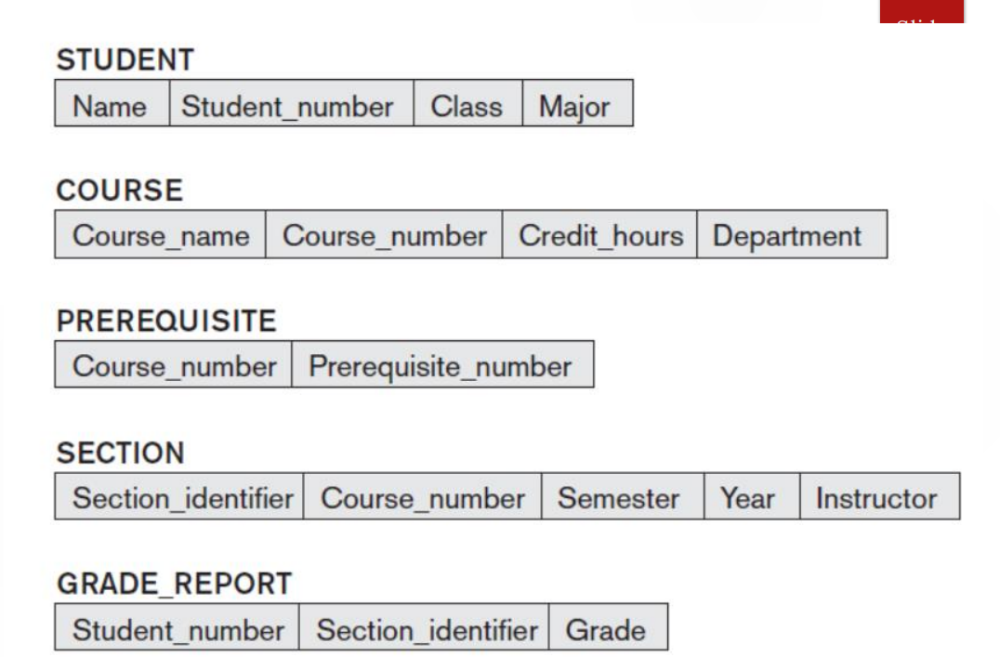
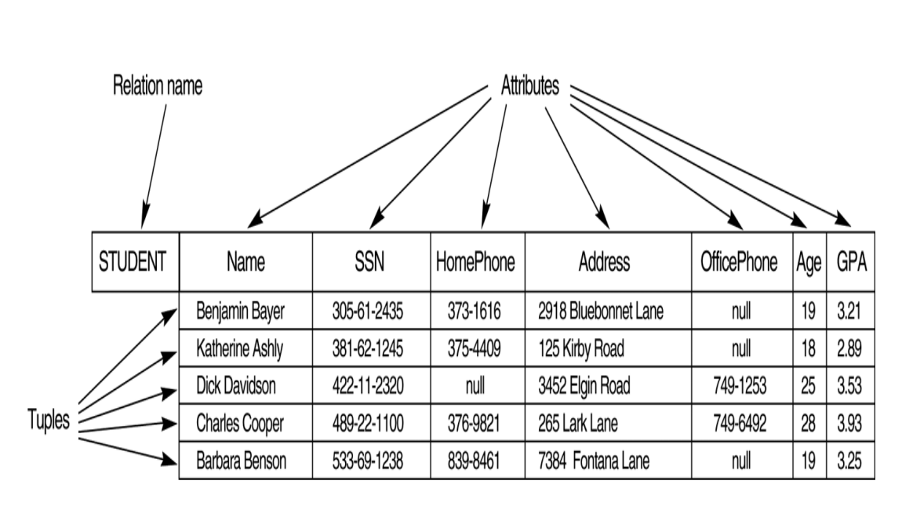
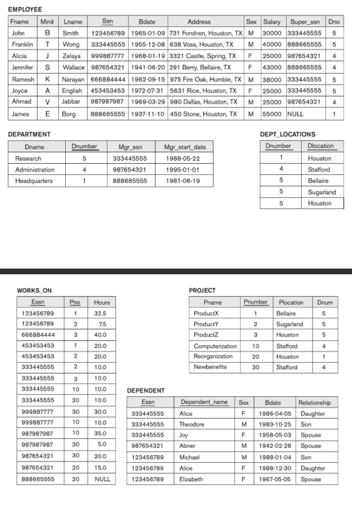
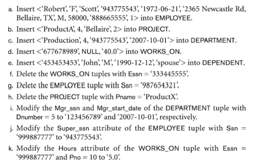

# Database

## Session 1: Introduction to Databases and PostgreSQL (4 hours)

### Why Databases and why not just files ?

#### File system problems

1. Lack of Data Consistency: File systems don't enforce any rules for data consistency, which means that there is no way to ensure that data is accurate and up-to-date.
2. Limited Data Access Control: File systems provide very limited mechanisms for controlling access to data, making it difficult to prevent unauthorized access or data breaches.
3. Poor Scalability: File systems are not designed to handle large amounts of data or support multiple users accessing the data simultaneously, which can make them slow and difficult to manage in larger organizations.
4. Limited Integration: File systems are not well-suited for integration with other applications and systems, which can make it difficult to share data across different contexts.
5. Limited Search Capabilities: File systems provide limited searching and sorting capabilities, which can make it difficult to find specific files or pieces of data.
6. Fragmentation: As files are added, deleted, and modified on a file system, the data becomes fragmented, which can slow down access times and make it more difficult to manage the data.
7. Backup and Recovery: File systems can be difficult to backup and recover, particularly in larger organizations where data is spread across multiple systems and locations.
8. File Corruption: File systems are susceptible to file corruption, which can result in the loss of important data.

#### how databases solve this issues

1. Data Consistency: Databases provide transaction management, which ensures that changes to the database are made in a consistent and reliable manner. This helps to prevent data inconsistencies and ensures that the data in the database is always accurate and up-to-date.
2. Data Access Control: Databases provide robust security mechanisms for controlling access to data. Users can be granted specific permissions to view, modify, or delete data, which helps to prevent unauthorized access or data breaches.
3. Scalability: Databases are designed to handle large amounts of data and support multiple users accessing the data simultaneously. This makes them well-suited for use in large organizations with complex data needs.
4. Integration: Databases are designed to be integrated with other applications and systems, which makes it easy to share data across different contexts. This can help to streamline workflows and reduce the need for manual data entry.
5. Search Capabilities: Databases provide powerful searching and sorting capabilities that allow users to quickly find specific records or pieces of data within the database. This makes it easy to analyze and extract insights from large amounts of data.
6. Fragmentation: Databases are designed to handle fragmentation in a more efficient way than file systems. For example, they may use indexing to store data in a more organized and efficient way, which can help to reduce fragmentation and improve performance.

### History of database

The history of databases dates back to the 1960s when computer scientists recognized the need for a more efficient way to store and manage large volumes of data. Here's a brief overview of the key milestones in the history of databases:

- 1960s: The first databases were hierarchical and used a tree-like structure to organize data. IBM's Information Management System (IMS) was one of the first hierarchical databases used in business applications
- 1970s: Edgar F. Codd, a computer scientist at IBM, introduced the concept of a relational database, which used tables to store and organize data. The Structured Query Language (SQL) was also developed in the 1970s as a standard language for managing relational databases.
- 1980s: The popularity of relational databases continued to grow throughout the 1980s, with Oracle, Microsoft SQL Server, and IBM DB2 becoming popular commercial database products. Object-oriented databases also emerged in the 1980s, which stored data as objects rather than in tables.
- 1990s: With the growth of the internet, the need for distributed databases grew, leading to the development of NoSQL databases, which could handle large volumes of unstructured data. The concept of data warehousing also emerged in the 1990s, which involved consolidating and organizing data from multiple sources to support business intelligence and decision-making.
- 2000s: Cloud computing and the rise of big data led to the development of new database technologies such as column-oriented databases, graph databases, and document-oriented databases. These databases were designed to handle the large volumes of unstructured data that were being generated by social media, mobile devices, and the Internet of Things (IoT).
- Present: Today, databases are a fundamental component of almost every application and technology. With the growth of artificial intelligence and machine learning, new database technologies are being developed to support the storage and analysis of complex data sets, such as neural networks and natural language processing.

### Users Of databases

1. Database administrators (DBAs): These are the individuals responsible for managing and maintaining the database system. They ensure that the system is performing optimally, monitor usage and activity, and handle issues and errors that arise.
2. Developers: These are the individuals responsible for designing and building the database applications. They create the database schema, write queries, and develop the software that interacts with the database.
3. End users: These are the individuals who use the database applications to access and manipulate data. They may be employees within an organization or external users, such as customers or clients.
4. Data analysts: These are the individuals who use the database to analyze and interpret data. They may use tools such as data mining, machine learning, or statistical analysis to identify patterns, trends, or insights in the data.
5. Data scientists: These are the individuals who use advanced techniques to extract knowledge and insights from data. They may use machine learning, natural language processing, or other techniques to derive insights from large, complex datasets.
6. Database vendors: These are the companies that create and sell database software and services. They may provide support, training, and consulting services to customers who use their products.
7. Security professionals: These are the individuals who are responsible for ensuring the security of the database system. They may develop and implement security policies, monitor for security breaches, and handle incidents or threats that arise.

### When Not to use Databases

While databases are an excellent tool for storing, retrieving, and managing data, there are certain scenarios where they may not be the best choice. Here are a few examples of when not to use databases:

1. Small-scale applications: If you have a small-scale application or project, such as a personal blog or a simple web application, you may not need the overhead of a database. In such cases, a flat-file or document-based system may be sufficient.
2. Static data: If your data is relatively static and doesn't change frequently, such as a list of country codes or a product catalog, a database may not be necessary. You could store the data in a file or cache it in memory for faster access.
3. Real-time data: If you are dealing with real-time data that requires extremely fast processing, such as stock market data or sensor data from IoT devices, a database may not be the best choice. In such cases, you may need to use specialized real-time data processing systems, such as Apache Kafka or Apache Flink.
4. High write throughput: If your application requires extremely high write throughput, such as in a log aggregation system or a social media platform, a database may not be the best choice. You may need to use specialized data stores, such as Apache Cassandra or Apache HBase, that are designed for high write throughput.
5. Low latency: If your application requires extremely low latency, such as in a gaming or real-time chat application, a database may not be the best choice. In such cases, you may need to use specialized in-memory data stores or message queues that can provide the required performance.

### Types of Databases

- Relational databases are a type of database that use a relational model to store and manage data. In a relational database, data is organized into tables, where each table represents a specific type of entity, such as customers, orders, or products. Each table is composed of rows and columns, with each row representing a specific instance of the entity, and each column representing a specific attribute or characteristic of the entity.

  The relationships between different tables are defined through the use of keys. Each table has a primary key, which uniquely identifies each row in the table, and can be used to link the table to other tables. Foreign keys are used to link the rows in one table to the rows in another table, allowing for complex data relationships and queries.

  Relational databases provide many benefits, including data integrity, data consistency, and scalability. They are widely used for enterprise-level applications, financial systems, and data-driven applications where data accuracy and consistency are critical. Some popular relational databases include Oracle, MySQL, Microsoft SQL Server, and PostgreSQL.
  

### What's SQL

SQL (Structured Query Language) is a programming language used to manage relational databases. It is used to create, modify, and delete database structures, as well as to manipulate the data stored in them.

SQL is a standard language that is used by many different database management systems, including Oracle, MySQL, Microsoft SQL Server, and PostgreSQL. SQL consists of a variety of commands, including those for data definition (DDL), data manipulation (DML), data control (DCL), and transaction control (TCL).

SQL is used in a wide range of applications, including web development, data analysis, and business intelligence. It is a powerful tool for managing large amounts of data, and its simplicity and flexibility make it easy to learn and use for both novice and experienced developers.

### Relational Model

The relational data model is a type of data model that organizes data into one or more tables, where each table consists of a set of rows and columns. The columns represent attributes of the data, while the rows represent individual instances of the data. The relational model allows for easy querying and manipulation of data using SQL, a common language used to interact with relational databases.

The columns in a table are referred to as "attributes" or "fields", and each attribute has a particular data type (such as integer, string, or date). Each value within a table belongs to a particular attribute and row, and represents a specific piece of data.

For example, consider a table called "Employees" that contains information about employees in a company. This table might have columns such as "EmployeeID", "FirstName", "LastName", "Email", "Department", and "Salary". Each row in the table would represent a specific employee, with values for each of the attributes. For instance, the row for an employee with ID 123 might have values of "123" for the EmployeeID attribute, "John" for the FirstName attribute, "Doe" for the LastName attribute, "jdoe@example.com" for the Email attribute, "Sales" for the Department attribute, and "50000" for the Salary attribute.

**Relational databases enforce a set of constraints on the data to ensure its integrity and consistency. These constraints include:**

1. Primary key constraint: A primary key is a unique identifier for each row in a table. It ensures that there are no duplicate rows in the table and allows for easy referencing of individual rows in the table.

2. Foreign key constraint: A foreign key is a reference to a primary key in another table. It ensures that the data in one table is related to the data in another table, and prevents the creation of orphaned rows (i.e. rows with no corresponding data in another table).

3. Not null constraint: This ensures that a particular column in a table cannot contain null values, which can cause issues with data integrity and querying.

4. Check constraint: This allows for the specification of a condition that must be met for data to be inserted or updated in a table. For example, a check constraint could ensure that a value in a certain column falls within a specified range.

5. Unique constraint: This ensures that a particular column or set of columns in a table contains only unique values.

### PostgreSql

PostgreSQL (often simply called "Postgres") is an open-source, object-relational database management system (DBMS) that uses and extends the SQL language. It was originally developed at the University of California, Berkeley in the 1980s, and is now maintained by a global community of developers.

PostgreSQL is known for its robustness, scalability, and extensibility, making it a popular choice for many large-scale applications. It is designed to handle high-volume, complex workloads and has features that support ACID (Atomicity, Consistency, Isolation, Durability) transactions and data integrity.

Some key features of PostgreSQL include:

Support for a wide range of data types, including arrays, geometric data, and JSON data
Advanced indexing techniques, including B-tree, hash, and GiST (Generalized Search Tree) indexes
Built-in support for full-text search
Support for stored procedures, triggers, and user-defined functions
Extensibility through the use of custom data types and operators
PostgreSQL is free and open-source software, which means that it can be used, modified, and distributed without cost or restriction. Its licensing model allows it to be used in both commercial and non-commercial applications.

Overall, PostgreSQL is a powerful and flexible database system that has gained a strong following among developers and businesses alike. Its wide range of features and flexibility make it a popular choice for many different types of applications.

### Installation and setup of PostgreSQL (30 minutes)

1. Download the installer: Go to the PostgreSQL [download page](https://www.postgresql.org/download/) and download the appropriate installer for your version of Windows (32-bit or 64-bit).

2. Run the installer: Double-click on the downloaded installer file and follow the prompts to install PostgreSQL on your system. During the installation process, you will be prompted to choose the installation directory, set the port number, and create a password for the default "postgres" user.

3. Start the PostgreSQL service: After installation, PostgreSQL should automatically start as a Windows service. To verify this, open the Services control panel (type "services.msc" in the Start menu) and look for the "PostgreSQL" service. If it is not running, you can start it manually by right-clicking on the service and selecting "Start".

4. Open the PostgreSQL command line: To use PostgreSQL, you can open the PostgreSQL command line (psql) by typing "psql" in the Start menu or by navigating to the installation directory and running the "psql.exe" file.

5. Create a new PostgreSQL user and database: To create a new user, you can use the following command in the psql prompt: CREATE USER [username] WITH PASSWORD '[password]';. Replace [username] and [password] with the desired username and password. To create a new database, you can use the following command: CREATE DATABASE [database_name];

## Session 2: ERD Diagram and Relationships

## Session 3: SQL

- **DDL**
- **DML**

## Session 4: Project
