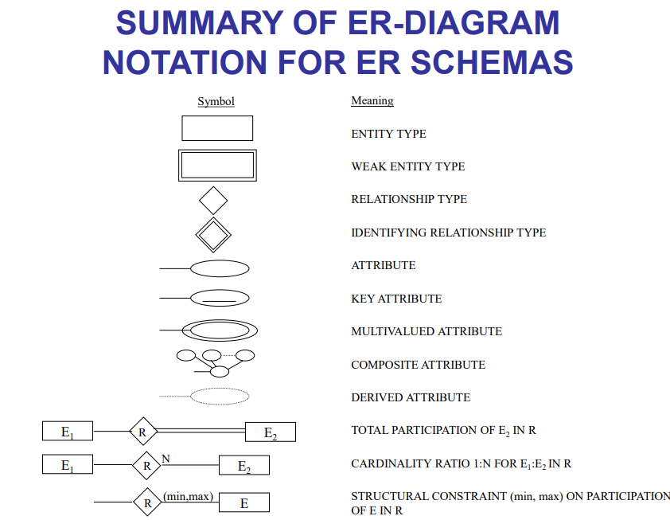
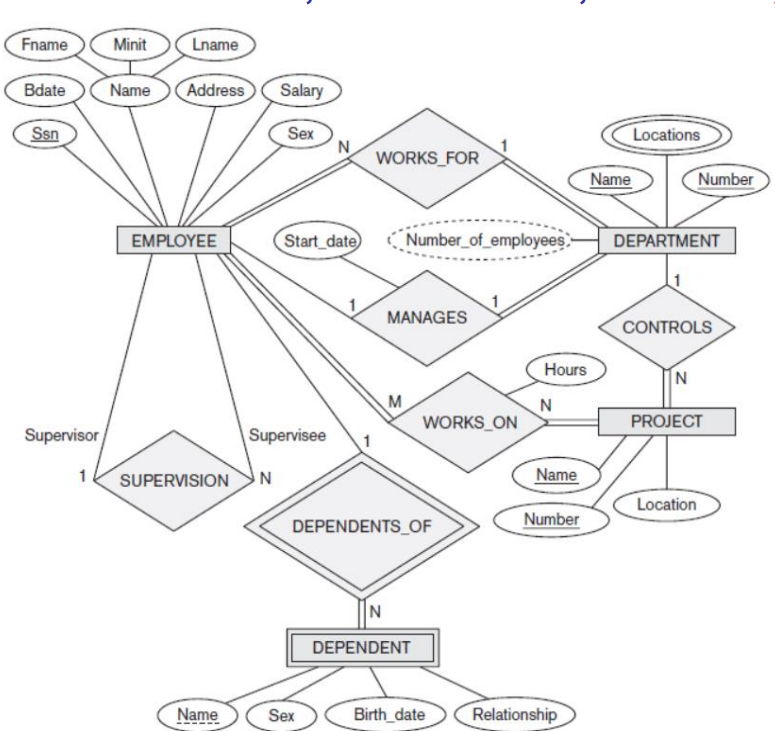

# Session 2

## Er diagram

### What's ER digram

An Entity-Relationship (ER) diagram is a type of graphical representation used to model the data or information requirements of a system or organization. ER diagrams are commonly used in software engineering and database design to illustrate the relationships between different entities within a system or organization.

ER diagrams typically consist of three main components:

1. entities
   Entities represent the objects or concepts within the system, such as customers, products, or orders.
2. attributes
   Attributes are the properties or characteristics of the entities, such as the customer's name or the product's price.
3. relationships.
   Relationships represent the connections or associations between entities, such as a customer placing an order or a product being part of a category.

ER diagrams are useful for visualizing complex data structures and relationships, as well as for communicating the data requirements of a system or organization to stakeholders. They can also be used to identify potential issues or inefficiencies within the system or organization, and to aid in the design of databases and software systems.

### How to make er diagram

1. Identify the entities: Begin by identifying all the entities involved in the system or organization you're modeling. For example, if you're modeling a library, the entities might include books, borrowers, and loans.

2. Determine the attributes: Next, determine the attributes or properties of each entity. For example, for the "book" entity, attributes might include the book's title, author, and ISBN.

3. Define the relationships: Determine the relationships between the entities. For example, a borrower can borrow many books, but a book can only be borrowed by one borrower at a time. This is a one-to-many relationship.

4. Determine the cardinality: Cardinality refers to the number of instances of one entity that can be associated with another. In the library example, the cardinality of the borrower-to-loan relationship is one-to-many (one borrower can have many loans, but each loan is associated with only one borrower).

5. Draw the ER diagram: Finally, create the diagram using the entities, attributes, relationships, and cardinality you have identified. Entities are represented by rectangles, attributes are represented by ovals, and relationships are represented by diamonds. Use lines to connect the entities and diamonds to show the relationships.

6. Refine the diagram: As you create the diagram, you may find that you need to adjust the relationships or cardinality. Refine the diagram until it accurately represents the system or organization you're modeling.

### ER diagram components

1. Entities: Entities represent the real-world objects or concepts that are important to the system or organization being modeled. Entities are typically represented by rectangles in an ER diagram, with the name of the entity written inside the rectangle. For example, in a database for a school, the entities might include students, teachers, and courses.

2. Attributes: Attributes are the properties or characteristics of the entities. They describe the data that is associated with the entity. Attributes are represented by ovals in an ER diagram, with the name of the attribute written inside the oval. For example, the attributes of a "student" entity might include the student's name, ID number, and date of birth.

3. Relationships: Relationships describe the connections or associations between entities. They show how the entities are related to each other. Relationships are represented by diamonds in an ER diagram, with the name of the relationship written inside the diamond. For example, in a school database, the relationship between students and courses might be represented by a diamond with the name "enrolled in." The lines connecting the entities to the diamonds show the direction of the relationship.

### ER shapes

1. Rectangle: Rectangles are used to represent entities in an ER diagram. Entities represent real-world objects or concepts that are important to the system or organization being modeled. The name of the entity is written inside the rectangle, and the attributes and primary key are listed inside the rectangle.

2. Diamond: Diamonds are used to represent relationships in an ER diagram. Relationships describe the connections or associations between entities. The name of the relationship is written inside the diamond.

3. Oval: Ovals are used to represent attributes in an ER diagram. Attributes describe the properties or characteristics of entities.

4. Double-lined rectangle: A double-lined rectangle is used to represent weak entities in an ER diagram. Weak entities are entities that cannot be uniquely identified without being associated with another entity.

5. Double-lined diamond: A double-lined diamond is used to represent identifying relationships in an ER diagram. Identifying relationships occur when the primary key of one entity is also a foreign key in another entity.

6. Circle: A circle is used to represent a specific type of attribute called a derived attribute. Derived attributes are calculated based on other attributes in the entity.

7. Double-lined oval: A double-lined oval is used to represent a multivalued attribute in an ER diagram. Multivalued attributes are attributes that can have multiple values.

8. Arrow: Arrows are used to represent the direction of a relationship between entities. The arrow points from the entity with the foreign key to the entity with the primary key.



### Lets dive into project

Suppose that you have a client who want to make a website for his company

The client said that to you i want to track the information about employees, departments, projects, and dependents.

The company is organized into departments, and each department has a unique name and number. Additionally, each department has a manager who is an employee within the company. The start date of the manager's tenure in that position is also recorded. Departments may have multiple locations.

The company's projects are also tracked, and each project has a unique name and number, along with a single location. Each department controls a number of projects.

Employee information is also recorded, including their name, Social Security number, address, salary, gender, and birth date. Each employee is assigned to one department but may work on multiple projects that may not necessarily be controlled by the same department. The number of hours each employee works on each project is also recorded. Additionally, each employee has a direct supervisor who is another employee within the company.

The dependents of each employee are also tracked for insurance purposes. Each dependent's first name, gender, birth date, and relationship to the employee are recorded.

let's begin with the database and get the entities and the attributes

#### the entities

Department: Unique name and number, manager (an employee), start date

Project: Unique name and number, location, department

Employee: Name, Social Security number, address, salary, gender, birth date, department, supervisor

Dependent: First name, gender, birth date, relationship to employee

#### the ER Diagram For the company



#### the sql code that describe this

```sql
CREATE TABLE department (
   department_id serial PRIMARY KEY,
   name VARCHAR(50) UNIQUE NOT NULL,
   manager_id INT NOT NULL,
   start_date DATE NOT NULL
);

CREATE TABLE department_location (
   department_id INT NOT NULL,
   location VARCHAR(50) NOT NULL,
   PRIMARY KEY (department_id, location),
   FOREIGN KEY (department_id) REFERENCES department (department_id)
);
CREATE TABLE project (
   project_id serial PRIMARY KEY,
   name VARCHAR(50) UNIQUE NOT NULL,
   location VARCHAR(50) NOT NULL,
   department_id INT NOT NULL,
   FOREIGN KEY (department_id) REFERENCES department (department_id)
);
CREATE TABLE employee (
   employee_id serial PRIMARY KEY,
   name VARCHAR(50) NOT NULL,
   ssn VARCHAR(11) UNIQUE NOT NULL,
   address VARCHAR(100),
   salary DECIMAL(10, 2),
   gender VARCHAR(10),
   birth_date DATE,
   department_id INT NOT NULL,
   supervisor_id INT,
   FOREIGN KEY (department_id) REFERENCES department (department_id),
   FOREIGN KEY (supervisor_id) REFERENCES employee (employee_id)
);
CREATE TABLE dependent (
   dependent_id serial PRIMARY KEY,
   first_name VARCHAR(50) NOT NULL,
   gender VARCHAR(10),
   birth_date DATE,
   relationship VARCHAR(50),
   employee_id INT NOT NULL,
   FOREIGN KEY (employee_id) REFERENCES employee (employee_id)
);
CREATE TABLE Employee_Project_Assignment (
    employee_id INTEGER REFERENCES Employee (employee_id),
    project_id INTEGER REFERENCES Project (project_id),
    hours_per_week INTEGER,
    PRIMARY KEY (employee_id, project_id),
    FOREIGN KEY (project_id) REFERENCES Project (project_id)
);
```

#### Explaining every single word of the code

- CREATE TABLE: This statement is used to create a new table in the database.
- department: This is the name of the table being created.
- serial: This data type is used to create an auto-incrementing integer column.
- PRIMARY KEY: This specifies the primary key column(s) for the table.
- VARCHAR(50): This data type is used to create a column with a variable-length string of up to 50 characters.
- UNIQUE: This constraint is used to ensure that the values in the column are unique.
- NOT NULL: This constraint is used to ensure that the column cannot contain null values.
- INT: This data type is used to create a column with integer values.
- DATE: This data type is used to create a column with date values.
- FOREIGN KEY: This constraint is used to create a relationship between two tables.
- department_location: This is the name of the table being created.
- location: This column is used to store the location of a department.
- project: This is the name of the table being created.
- project_id: This column is used to store the unique identifier of a project.
- employee: This is the name of the table being created.
- ssn: This column is used to store the Social Security Number of an employee.
- address: This column is used to store the address of an employee.
- salary: This column is used to store the salary of an employee.
- gender: This column is used to store the gender of an employee.
- birth_date: This column is used to store the birth date of an employee.
- supervisor_id: This column is used to store the ID of an employee's supervisor.
- dependent: This is the name of the table being created.
- dependent_id: This column is used to store the unique identifier of a dependent.
- relationship: This column is used to store the relationship between an employee and their dependent.
- Employee_Project_Assignment: This is the name of the table being created.
- hours_per_week: This column is used to store the number of hours an employee works on a project per week.

#### TASK

Make a mini world

A social media platform that allows users to create profiles, share posts, follow other users, and like and comment on posts. Each user has a unique username and password, and they can fill out their profile information including their name, email, and bio. Users can upload profile pictures and cover photos.

Users can create posts, which include text, photos, and videos. Each post has a timestamp and can be tagged with topics or hashtags. Users can also like and comment on posts, and they can share posts to their own followers or specific groups.

Users can follow other users to see their posts on their feed. Users can also create and join groups, which are collections of users who share a common interest or goal. Groups have a name, description, and cover photo.

The platform also tracks analytics about user engagement and post performance. Each post has a number of likes, comments, and shares, and the platform can show users their most popular posts and followers.

Students can use this miniworld to create an ER diagram that represents the entities and relationships in the social media web app.

**Use [this](https://app.creately.com/) and it will help you ISA**

### More tasks

- ECommerce app
  An ecommerce application miniworld would involve the representation of a simplified online store, where customers can browse and purchase products from the store. The entities involved in this miniworld would include customers, products, orders, payments, and shipping details.

  The customer entity would include attributes such as customer ID, name, email address, shipping address, and payment information. The product entity would include attributes such as product ID, name, description, price, and quantity in stock. The order entity would include attributes such as order ID, customer ID, order date, and order status. The payment entity would include attributes such as payment ID, order ID, payment method, and payment amount. Finally, the shipping details entity would include attributes such as shipping ID, order ID, shipping address, and shipping status.

  The relationships between these entities would be as follows:

  Each customer can place multiple orders, but each order belongs to a single customer.
  Each order can contain multiple products, and each product can appear in multiple orders.
  Each order must have associated payment and shipping details.

- College Management system

  A college management system miniworld is a system designed to manage various aspects of a college or university. Here is a description of the various entities, relationships, and data attributes that could be involved in this miniworld:

  Entities:

  Students: Individuals who are enrolled in the college or university.
  Faculty: Teachers or professors who teach courses at the college or university.
  Courses: Academic courses offered by the college or university.
  Departments: Academic departments within the college or university.
  Staff: Administrative and support staff who work at the college or university.
  Classes: Sections of courses that students can register for and attend.
  Relationships:

  Students can register for multiple courses, and each course can have multiple students enrolled in it.
  Faculty can teach multiple courses, and each course can be taught by one or more faculty members.
  Courses belong to one or more departments, and each department can offer multiple courses.
  Staff members can work in one or more departments.
  Classes are associated with one course, and each course can have multiple classes.

  Data Attributes:

  Students: Name, date of birth, address, contact details, major, academic records, and extracurricular activities.
  Faculty: Name, contact details, academic qualifications, courses taught, and research interests.
  Courses: Course code, course name, course description, credit hours, department offering the course, and prerequisites.
  Departments: Department code, department name, department chair, and faculty members.
  Staff: Name, contact details, department, and job responsibilities.
  Classes: Class ID, course code, faculty member(s) teaching the class, schedule, classroom, and enrollment limit.
