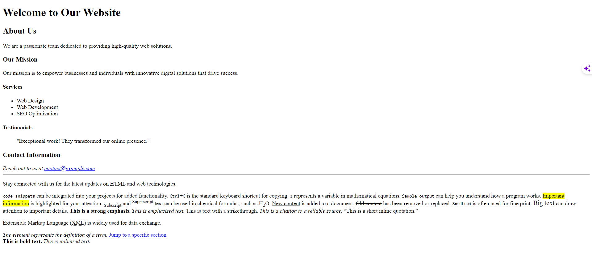

```html
<!DOCTYPE html>
<html lang="en">
<head>
    <meta charset="UTF-8">
    <meta name="viewport" content="width=device-width, initial-scale=1.0">
    <title>Semantic HTML Page</title>
</head>
<body>
    <header>
        <h1>Welcome to My Website</h1>
    </header>

    <nav>
        <ul>
            <li><a href="#">Home</a></li>
            <li><a href="#">About</a></li>
            <li><a href="#">Services</a></li>
            <li><a href="#">Contact</a></li>
        </ul>
    </nav>

    <main>
        <section>
            <h2>About Us</h2>
            <article>
                <h3>Our Story</h3>
                <p>Lorem, ipsum dolor sit amet consectetur adipisicing elit. Quasi omnis, ratione quaerat cupiditate, facere soluta voluptate cum sed repudiandae pariatur, illo magnam at aliquam modi vel fugiat et aliquid praesentium!</p>
            </article>
            <article>
                <h3>Our Team</h3>
                <p>Lorem, ipsum dolor sit amet consectetur adipisicing elit. Quasi omnis, ratione quaerat cupiditate, facere soluta voluptate cum sed repudiandae pariatur, illo magnam at aliquam modi vel fugiat et aliquid praesentium!</p>
            </article>
        </section>

        <section>
            <h2>Services</h2>
            <article>
                <h3>Web Design</h3>
                <p>Lorem, ipsum dolor sit amet consectetur adipisicing elit. Quasi omnis, ratione quaerat cupiditate, facere soluta voluptate cum sed repudiandae pariatur, illo magnam at aliquam modi vel fugiat et aliquid praesentium!</p>
            </article>
            <article>
                <h3>SEO Optimization</h3>
                <p>Lorem, ipsum dolor sit amet consectetur adipisicing elit. Quasi omnis, ratione quaerat cupiditate, facere soluta voluptate cum sed repudiandae pariatur, illo magnam at aliquam modi vel fugiat et aliquid praesentium!</p>
            </article>
        </section>
    </main>

    <footer>
        <p>&copy; 2023 My Website</p>
    </footer>

    <aside>
        <h2>Latest News</h2>
        <article>
            <h3>Article Title</h3>
            <p>Lorem, ipsum dolor sit amet consectetur adipisicing elit. Quasi omnis, ratione quaerat cupiditate, facere soluta voluptate cum sed repudiandae pariatur, illo magnam at aliquam modi vel fugiat et aliquid praesentium!</p>
        </article>
        <article>
            <h3>Another Article</h3>
            <p>Lorem, ipsum dolor sit amet consectetur adipisicing elit. Quasi omnis, ratione quaerat cupiditate, facere soluta voluptate cum sed repudiandae pariatur, illo magnam at aliquam modi vel fugiat et aliquid praesentium!</p>
        </article>
    </aside>

    <figure>
        
        <figcaption>Caption for the image</figcaption>
    </figure>

    <time >September 27, 2023</time>

    <mark>This text is highlighted for emphasis.</mark>

    <code>function sayHello() { console.log("Hello, World!"); }</code>

    <abbr title="Hypertext Markup Language">HTML</abbr>

    <cite>Author's Name</cite>

    <address>
        <p>Contact us at <a href="mailto:contact@example.com">contact@example.com</a></p>
        <p>123 Main Street, City</p>
    </address>

    <dfn title="Definition">This is a definition.</dfn>
</body>
</html>


```