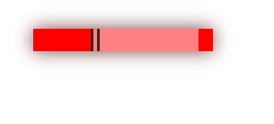

# Task List

## Task 1: Analyze Website Semantics
- **Objective:** Analyze the semantic structure of a popular website.
- **Description:** Choose one of the popular websites such as Wikipedia, Facebook, or Amazon, and try to guess how the elements on the website are structured in a semantic way. Look for HTML elements, attributes, and their respective roles in creating a well-structured and meaningful web page. Provide insights into how these elements contribute to the overall user experience and content organization.

## Task 2: Create a Form
- **Objective:** Create a form for a specific purpose.
- **Description:** Design and create a web form for a hypothetical scenario or real-life application. Specify the purpose of the form (e.g., user registration, feedback, survey), and design the form elements (text fields, radio buttons, checkboxes, etc.) accordingly. Pay attention to form validation and user-friendliness. You can use HTML and CSS for this task.

## Task 3: CSS Basics for Beginners
- **Objective:** Create a beginner-level CSS task.
- **Description:** Try to Make this 

