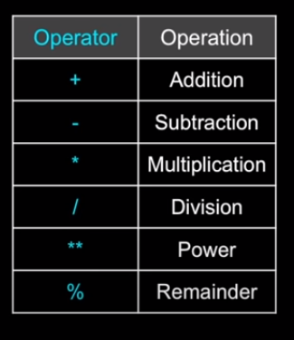

# Python

# Session 1

- Installation [Python](https://www.python.org/downloads/)
  - in the installation we install Python interpreter which interpret from python to a language that the machine know, the standard library , and some tools such as the pip package manager.
- Information about python
  - first released in 1991
  - general-purpose language that is used in a wide variety of fields, including web development, data analysis, artificial intelligence, scientific computing, and many others.
  - Python is so popular is its simplicity and ease of use
  - popular is its vast and active community.
  - It is also cross-platform, meaning that code written on one platform can be easily run on another.
  - the creator of Python, was a big fan of the British comedy group Monty Monty Python's Flying Circus, a popular British sketch comedy show that aired in the 1970s.
  - it provides automatic memory management through a process called garbage collection.
  - python is interpreted language [Snake]
  - developed by [Guido van Rossum](https://en.wikipedia.org/wiki/Guido_van_Rossum)
  - Reserved Words : the way of exploring any language even the natural one is by knowing it's words which uses to communicate with others who know it, so the python like any lang have a words that reserved to itself, have implicit meaning can't be changed, they are :
    - 
  - can be written Interactive or script : like js it can be written line by ine from the cmd and each line you write the interpreter interpret it ant execute it immediately and can be written as script on a file and run the file only one time

## Variables

Variables are used in Python to store and manipulate data. They are essentially named containers that hold a value. In this tutorial, we will learn how to declare and assign values to variables in Python.

### Declaring Variables

In Python, we do not need to declare variables before using them. We can simply assign a value to a variable, and Python will create the variable for us. Here is an example of how to declare a variable:

```python
x = 5
```

In this example, we are declaring a variable named x and assigning it the value of 5. The equal sign = is used to assign a value to a variable.

We can also declare multiple variables at once by separating them with a comma. Here is an example

```python
x, y, z = 1, 2, 3
```

### Data Types

In Python, variables can hold values of different data types. Some of the commonly used data types are:

Integer (int): a whole number, such as 5 or 100.
Float (float): a decimal number, such as 3.14 or 2.0.
String (str): a sequence of characters, such as "hello" or "world".
Boolean (bool): a value that is either True or False.
List (list): a collection of values, such as [1, 2, 3] or ["apple", "banana", "orange"].
Tuple (tuple): a collection of values, similar to a list, but cannot be modified, such as (1, 2, 3) or ("apple", "banana", "orange").
Dictionary (dict): a collection of key-value pairs, such as {"name": "John", "age": 30}.

In Python, we can check the data type of a variable using the type() function. Here is an example:

```python
x = 5
print(type(x))
```

In this example, we are declaring a variable x and assigning it the value of 5. We are then using the type() function to check the data type of x. The output will be <class 'int'>, which means x is an integer.

### variables name rules snake_case

hamada_age
bad code

```python
  djafkljdkflj = 35.0
  ajkfjdalfjks = 12.5
  kjdaskfjkhfa = djafkljdkflj * ajkfjdalfjks
  print(kjdaskfjkhfa)
```

- code can be read

```python
 a = 35.0
 b = 12.5
 c = a * b
 print(c)
```

- much better code

```python
 hours = 35.0
 rate = 12.5
 pay = hours * rate
 print(pay)
```

### Expressions

- Expressions evaluated from left to right

  ```python
  x = 0.6
  x = x * 25 * (3-x) * 7 / x
  print(x)
  ```

  - Operators on Python
    
  - precedence rule :
    **Parenthesis > Power > Multiplication > Addition > Left to Right**

    ```python
    x = 1 + 2 ** 3 / 4 * 5
    x =  1 + 8 / 4 * 5
    x =  1 + 2 * 5
    x =  1 + 10
    x = 11
    ```

  - pluse (+) can be work as addition or concatenation
  - functions [type , float , int , str , print , input]
  - Comments [ # ]
  - Comparison Operators [< , > , == , >= , <= , !=]

## if Statement

```python
if condition1:
  # code to be executed if condition1 is true
elif condition2:
  # code to be executed if condition2 is true
else:
  # code to be executed if neither condition1 nor condition2 is true
```

### Logical Operators

1. **and**: Returns **True** if both operands are **True**. Otherwise, returns **False**.
2. **or**: Returns **True** if at least one of the operands is **True**. Otherwise, returns False.
3. **not**: Returns the opposite of the operand. If the operand is **True**, returns **False**. If the operand is **False**, returns **True**.

```python
x = 5
y = 10

if x > 0 and y < 15:
    print("Both conditions are True")

if x > 10 or y < 15:
    print("At least one condition is True")

if not x == y:
    print("x is not equal to y")

```

### Short-Circuit Evaluation

logical operators use short-circuit evaluation. This means that if the first operand of an and expression evaluates to False, the second operand is not evaluated, because the entire expression will always be False. Similarly, if the first operand of an or expression evaluates to True, the second operand is not evaluated, because the entire expression will always be True.

```python
def divide(x, y):
    if y != 0 and x / y > 2:
        return "x is more than twice y"
    else:
        return "y is either zero or x is less than or equal to twice y"

print(divide(10, 3))
print(divide(10, 5))
print(divide(10, 0))
```

## python code life time

Python is an interpreted language, which means that the code is executed by an interpreter at runtime, rather than being compiled into machine code ahead of time. When you run a Python program, the interpreter reads your code line by line, interpreting each statement and executing it immediately.

Python is an interpreted language, which means that the code is executed by an interpreter at runtime, rather than being compiled into machine code ahead of time. When you run a Python program, the interpreter reads your code line by line, interpreting each statement and executing it immediately.

Here's a simplified overview of the process of interpreting Python code:

- Tokenization: The interpreter reads the source code and breaks it down into a sequence of tokens, which are the basic units of the language, such as keywords, identifiers, operators, and literals.
- Parsing: The interpreter uses the tokens to build an abstract syntax tree (AST), which represents the structure of the program according to the rules of the Python grammar. The AST is a hierarchical tree-like structure that describes the relationships between the statements, expressions, and other language constructs in the program.
- Compilation: The interpreter generates bytecode from the AST, which is a lower-level representation of the program that can be executed by the Python virtual machine (PVM). The bytecode is a sequence of instructions that perform the operations specified by the code, such as assigning values to variables, calling functions, and so on.
- Execution: The interpreter runs the bytecode on the PVM, which is a runtime environment that provides the necessary infrastructure to execute the code. The PVM executes the bytecode instruction by instruction, updating the program state as it goes, such as the values of variables and the call stack.

```python
# Example code
x = 10
y = 5
if x > y:
    print("x is greater than y")
else:
    print("y is greater than x")

```

When this code is executed, the interpreter does the following:

1. Tokenizes the code into a sequence of tokens, such as x, =, 10, if, x, >, y, :, print, "x is greater than y", else, :, print, "y is greater than x", and so on.
2. Parses the tokens into an AST, which represents the structure of the code, such as a Module node with a Body node containing a FunctionDef node for the main function, a Assign node for the x = 10 statement, a Assign node for the y = 5 statement, a If node for the if statement, and so on.
3. Compiles the AST into bytecode, which represents the lower-level instructions to execute the code, such as LOAD_CONST for the 10 literal, STORE_NAME for the x variable, LOAD_NAME for the x and y variables, COMPARE_OP for the > operator, POP_JUMP_IF_FALSE for the else branch, LOAD_CONST for the "x is greater than y" string, PRINT_ITEM and PRINT_NEWLINE for the print() function, and so on.
4. Executes the bytecode on the PVM, which updates the program state and produces the output, such as x being assigned to 10, y being assigned to 5, the comparison between x and y being performed, the "x is greater than y" string being printed, and so on.

### obtain the byte code

```python
import marshal

# Open the Python file and read its contents
with open('example.py', 'r') as f:
    source_code = f.read()

# Compile the source code into a code object
code = compile(source_code, 'example.py', 'exec')

# Convert the code object to a binary format
code_bytes = marshal.dumps(code)

# Print the bytecode in hexadecimal format
print(code_bytes.hex())

```

In this example, example.py is the name of the Python file you want to compile. The compile() function takes three arguments: the source code as a string, the filename (which can be any string), and the mode, which can be 'exec', 'eval', or 'single'. The 'exec' mode is used for compiling a module or a program, and is the most common mode.

The compile() function returns a code object that represents the compiled bytecode. To print the bytecode in a readable format, we can use the hex() method to convert the bytecode to hexadecimal format.

[**AST visualization**](https://python-ast-explorer.com/)

## Tasks

1. Create a simple calculator that takes user input and performs basic arithmetic operations such as addition, subtraction, multiplication, and division using the arithmetic operators.
2. Write a program that prompts the user to enter a temperature in Celsius and converts it to Fahrenheit using the appropriate formula.
3. Write a program that prompts the user to enter a number and checks if it is a prime number using a loop and the modulo operator.
4. Write a program that input a number and output the equevelent day of the week to it
5. Write a progamme to get a grade and print the equeelent [excellent , very good , good , accpted , fail ]

# Session 2

## Python Loops

### For Loops

A for loop is used to iterate over a sequence (that is either a list, a tuple, a dictionary, a set, or a string).

```python
for variable in sequence:
    # code to be executed for each item in sequence
```

#### The range() Function

The range() function can be used to generate a sequence of numbers that can be used in a for loop. Here's the basic syntax for the range() function:

```python
for x in range(5):
    print(x)
```

### While Loops

A while loop is used to repeatedly execute a block of code as long as a specified condition is true. Here's the basic syntax for a while loop:

```python
while condition:
    # code to be executed while the condition is true
```

### break statement

```python
i = 0
while i < 5:
    print(i)
    i += 1
    if i == 3:
        break

```

### continue statement

```python
i = 0
while i < 5:
    print(i)
    i += 1
    if i == 3:
        continue
```

## Strings

A string is a sequence of characters in Python. You can create a string by enclosing characters inside single or double quotes. For example:

```python
my_string = "Hello, World!"
# you can use single or double quotes
```

### multiline string

The ''' and """ characters are used to create multi-line string literals in Python. A multi-line string literal can span across multiple lines of code and can contain newline characters, tabs, and other whitespace characters.

For example, you can define a multi-line string literal like this:

```python
my_string = '''
This is a multi-line string.
It can contain multiple lines of text.
Each line can include newline characters,
tabs, and other whitespace.
'''
```

_You can also use double quotes (""") instead of single quotes (''') to create a multi-line string literal._

### Formatted String

You can use formatted string literals (f-strings) to insert values into strings in Python. Formatted string literals are a recent addition to Python, introduced in Python 3.6, and they provide a more concise and readable way to format strings compared to other methods such as the % operator or the str.format() method.

```python
name = 'Alice'
age = 30
profession = 'software engineer'

# Create a formatted string using f-strings
greeting = f"Hello, my name is {name}. I'm {age} years old, and I work as a {profession}."

# Print the formatted string
print(greeting)

```

### Formatted multiline string

```python
name = "John"
age = 30

message = f'''
Hello {name},
You are {age} years old.
'''

print(message)
```

### String Operations

1.  Concatenation
    You can concatenate strings using the + operator. For example:

    ```python
    first_name = 'John'
    last_name = 'Doe'
    full_name = first_name + ' ' + last_name
    ```

2.  Repetition
    You can repeat a string multiple times using the \_ operator. For example:

    ```python
    my_string = 'hello '
    my_string = my_string * 3

    ```

3.  Slicing
    You can slice a string to obtain a specific portion of it. The syntax for slicing is string[start:stop:step], where start is the index of the first character you want to include, stop is the index of the first character you want to exclude, and step is the size of the jump between characters. For example:

    ```python
    my_string = 'hello world'
    substring = my_string[0:5] # substring is set to 'hello'
    ```

4.  Length
    You can find the length of a string using the len() function. For example:

```python
my_string = 'hello world'
length = len(my_string) # length is set to 11
```

### string functions

```python
s = "The quick brown fox jumps over the lazy dog"

# Convert the string to uppercase
s_upper = s.upper()
print(s_upper)  # Output: "THE QUICK BROWN FOX JUMPS OVER THE LAZY DOG"

# Convert the string to lowercase
s_lower = s.lower()
print(s_lower)  # Output: "the quick brown fox jumps over the lazy dog"

# Replace a substring with another substring
s_replaced = s.replace("fox", "cat")
print(s_replaced)  # Output: "The quick brown cat jumps over the lazy dog"

# Count the occurrences of a substring
s_count = s.count("o")
print(s_count)  # Output: 4

# Check if the string starts with a specific substring
s_starts_with = s.startswith("The")
print(s_starts_with)  # Output: True

# Check if the string ends with a specific substring
s_ends_with = s.endswith("dog")
print(s_ends_with)  # Output: True

# Split the string into a list of substrings
s_split = s.split()
print(s_split)  # Output: ["The", "quick", "brown", "fox", "jumps", "over", "the", "lazy", "dog"]

# Join a list of substrings into a single string
s_join = "-".join(s_split)
print(s_join)  # Output: "The-quick-brown-fox-jumps-over-the-lazy-dog"

my_string = "Hello World!"
# strip : Removes leading and trailing whitespace from a string.
print(my_string.strip()) # Output: Hello World!

```

## File Handling

File handling is an important part of any programming language, and Python provides several ways to handle files. In this tutorial, we will discuss file handling in Python and how to read, write, and manipulate files.

### Opening a File

```python
file = open('example.txt', 'r')
```

**modes**

- 'r' : is the mode of the opinning the file indecationg READ the file
  there aree several medes
- 'w': write mode, which truncates the file and overwrites any existing data.
- 'a': append mode, which adds new data to the end of the file.
- 'x': exclusive creation mode, which creates a new file and raises an error if the file already exists.
- 'b': binary mode, which reads or writes in binary format.

- 'r+' mode opens a file for both reading and writing. The file pointer is placed at the beginning of the file, and you can both read from and write to the file. If the file doesn't exist, you'll get a FileNotFoundError.
- 'w+' mode opens a file for both writing and reading. If the file already exists, it is truncated to zero length. If the file does not exist, it is created. The file pointer is placed at the beginning of the file. In this mode, you can both read from and write to the file.

#### Reading from a File

**_read the whole file_**

```python
file = open('example.txt', 'r')
data = file.read()
print(data)
file.close()
```

**_read line by line_**

```python
file = open('example.txt', 'r')
for line in file:
    print(line)
file.close()
```

We can also read a specific number of characters using read(n), where n is the number of characters to read.

```python
file = open('example.txt', 'r')
data = file.read(10)
print(data)
file.close()

```

#### Writing to a File

```python
file = open('example.txt', 'w')
file.write('Hello, world!')
file.close()
```

**_or_**

```python
file = open('example.txt', 'w')
lines = ['First line\n', 'Second line\n', 'Third line\n']
file.writelines(lines)
file.close()
```

**_append to file_**

```python
file = open('example.txt', 'a')
file.write('Fourth line\n')
file.close()
```

#### Closing a File

It is important to always close a file when we are done with it using the close() method
**_why ? _**

- Resource leakage: An open file uses up system resources such as memory and file handles. If a file is not closed, those resources may not be released until the program ends or the file is closed manually. This can lead to a memory leak or other resource problems.

- Data corruption: If data is written to an unclosed file, the file may not be properly flushed, and the data may not be completely written to disk. This can result in data corruption, where the file is unreadable or contains invalid data.

- Locking: An open file may be locked by the operating system or other programs, preventing other programs from accessing it. If a file is not closed, it may remain locked even if the program that opened it has ended, preventing other programs from using it.

- Security issues: Leaving a file open may expose sensitive data or allow unauthorized access to the file. If the program that opened the file is compromised, an attacker may be able to access or modify the file.

#### using With keyword

close file automatically

```python
with open('example.txt', 'r') as file:
    data = file.read()
    print(data)
```

**what's the output of this code if the data.txt have "hello word"**

```python
file = open("dat.txt" , 'r+' , encoding="UTF-8")
print(file.read())
file.write("hello world")
print(file.read())
```

## Tasks

1. Write a program that prompts the user to enter a string and counts the number of characters in the string using the len() function.
2. Write a program that prompts the user to enter a number and determines whether it is even or odd using the modulo operator (%).
3. Write a program that uses a for loop to iterate over a list of numbers and prints the sum of the numbers.
4. Write a program that uses a while loop to repeatedly prompt the user to enter a password until they enter the correct password.
5. Write a program that reads a file and counts the number of lines, words, and characters in the file.
6. Write a program that uses a function to calculate the area and perimeter of a rectangle based on user input for the length and width.
7. Write a program that prompts the user to enter a sentence and then reverses the order of the words in the sentence.
8. Create a Python program that reads the contents of a text file and prints them to the console.
9. Write a Python program that creates a new file, writes some text to it, and then reads the text back from the file and prints it to the console.
10. Modify the previous program to append new text to the end of the file instead of overwriting the existing text.

# Session 3

## Functions

A function is a block of code that performs a specific task. It can take input(s), perform operations on those inputs, and return output(s).

In Python, you define a function using the **def** keyword followed by the **function name**, **input parameters** (if any), and a **colon**. The body of the function is indented and contains the code that performs the task. Here's an example of a simple function that takes two arguments and returns their sum:

```python
def add_numbers(a, b):
    sum = a + b
    return sum
```

To call this function, you simply pass in two arguments:

```python
result = add_numbers(3, 5)
print(result)   # Output: 8
```

Functions can also have optional parameters with default values. For example, we can modify the add_numbers() function to take a third optional parameter that defaults to 0:

```python
def add_numbers(a, b, c=0):
    sum = a + b + c
    return sum
```

if we call the function with two arguments, it will use the default value for c

```python
result = add_numbers(3, 5)
print(result)   # Output: 8

result2 = add_numbers(3, 5, 2)
print(result2)   # Output: 10

```

Functions can also return multiple values by separating them with commas.

```python
def add_numbers(a, b):
    sum = a + b
    product = a * b
    return sum, product

result = add_numbers(3, 5)
print(result)   # Output: (8, 15)

# Or

sum, product = add_numbers(3, 5)
print(sum)      # Output: 8
print(product)  # Output: 15

```

functions can be nested inside other functions,

```python
def calculate_total_price(price, tax_rate):
    def calculate_tax(price, tax_rate):
        return price * tax_rate

    tax = calculate_tax(price, tax_rate)
    total_price = price + tax
    return total_price

```

In this example, we have a calculate_tax() function nested inside the calculate_total_price() function. The calculate_tax() function takes the price and tax rate as inputs and returns the tax amount. The calculate_total_price() function then calls calculate_tax() to get the tax amount and adds it to the original price to get the total price, which is returned.

you can add docstring to a function
A docstring is a string literal that appears as the first statement in a function definition. It is used to document what the function does, what parameters it expects, and what it returns.

```python
def add_numbers(a, b):
    """
    Returns the sum of two numbers.

    Args:
        a (int): The first number.
        b (int): The second number.

    Returns:
        int: The sum of `a` and `b`.
    """
    sum = a + b
    return sum
print(add_numbers.__doc__)

# Output :
    # Returns the sum of two numbers.

    # Args:
    #     a (int): The first number.
    #     b (int): The second number.

    # Returns:
    #     int: The sum of `a` and `b`.

```

### internal overview

When you define a function in Python, the function name becomes a reference to the function object in memory. This means that you can assign the function to a variable, pass it as an argument to another function, or return it from a function.

The function object itself contains several attributes, including:

    - **__name__**: The name of the function.
    - **__doc__**: The docstring (if any) that describes the function.
    - **__defaults__**: A tuple containing the default values for any optional parameters.
    - **__code__**: The compiled bytecode for the function.
    - **__globals__**: A dictionary containing the global namespace for the function.

When you call a function in Python, the interpreter creates a new local namespace for the function. This namespace contains all the variables and objects that are defined within the function, as well as any parameters that were passed to the function.

When the function finishes executing, the local namespace is destroyed, and any values that were created within the function are lost (unless they were returned by the function or stored in a global variable).

For example

```python
def add_numbers(a, b):
    sum = a + b
    return sum

```

When you call this function with the values 3 and 5, the interpreter creates a new local namespace for the function and assigns the values 3 and 5 to the variables a and b, respectively. It then creates a new variable sum and assigns it the value 8.

The return statement tells the interpreter to return the value of sum to the caller, and the local namespace is destroyed.

## List , Dictionary Comprehensions

### List

Lists are a fundamental data structure in Python that are used to store a collection of values. In this tutorial, we'll cover the basics of lists in Python, including how to create and manipulate them

#### Creating Lists

```python
my_list = [1, 2, 3, 4, 5]
nested_list = [[1, 2], [3, 4], [5, 6]]

```

#### Accessing List Elements

```python
my_list = [1, 2, 3, 4, 5]
print(my_list[0])  # prints 1
print(my_list[2])  # prints 3

# Negative indexing

print(my_list[-1])  # prints 5
print(my_list[-3])  # prints 3

```

#### Slicing Lists

```python
my_list = [1, 2, 3, 4, 5]
print(my_list[1:3])  # prints [2, 3]
print(my_list[:3])   # prints [1, 2, 3]
print(my_list[3:])   # prints [4, 5]
```

#### Modifying Lists

```python
my_list = [1, 2, 3, 4, 5]
my_list[2] = 7       # replaces 3 with 7
my_list[1:4] = [8, 9, 10]  # replaces [2, 3, 4] with [8, 9, 10]

```

#### List functions Example

```python
# Creating a list
fruits = ['apple', 'banana', 'cherry']

# append() - Adds an element to the end of the list
fruits.append('orange')
print(fruits) # ['apple', 'banana', 'cherry', 'orange']

# insert() - Adds an element at the specified position in the list
fruits.insert(1, 'grape')
print(fruits) # ['apple', 'grape', 'banana', 'cherry', 'orange']

# remove() - Removes the first occurrence of the specified element from the list
fruits.remove('banana')
print(fruits) # ['apple', 'grape', 'cherry', 'orange']

# pop() - Removes the element at the specified position or the last element if index is not specified, and returns it
popped = fruits.pop(1)
print(popped) # 'grape'
print(fruits) # ['apple', 'cherry', 'orange']

# clear() - Removes all elements from the list
fruits.clear()
print(fruits) # []

# extend() - Adds all elements of a list (or any iterable) to the end of the list
fruits.extend(['kiwi', 'mango'])
print(fruits) # ['kiwi', 'mango']

# index() - Returns the index of the first occurrence of the specified element in the list
index = fruits.index('kiwi')
print(index) # 0

# count() - Returns the number of times the specified element appears in the list
count = fruits.count('mango')
print(count) # 1

# sort() - Sorts the elements of the list in ascending order
fruits.sort()
print(fruits) # ['kiwi', 'mango']

# reverse() - Reverses the order of the elements in the list
fruits.reverse()
print(fruits) # ['mango', 'kiwi']

# copy() - Returns a copy of the list
fruits_copy = fruits.copy()
print(fruits_copy) # ['mango', 'kiwi']
```

#### comprehension

List comprehension is a concise and elegant way to create new lists from an existing list or other iterable. It can be used to perform various operations like filtering, mapping, and sorting on lists.

```python
new_list = [expression for item in iterable if condition]

```

- **new_list**: the new list to be created.
- **expression**: the operation to be performed on each item in the iterable.
- **item**: the variable that represents each item in the iterable.
- **iterable**: the original list or other iterable.
- **condition**: (optional) the condition that must be satisfied for an item to be included in the new list.

**_examples about list comprehension_**

```python
# Example 1: Squaring each element in a list
numbers = [1, 2, 3, 4, 5]
squares = [num**2 for num in numbers]
print(squares) # Output: [1, 4, 9, 16, 25]

# Example 2: Filtering odd numbers from a list
numbers = [1, 2, 3, 4, 5]
odds = [num for num in numbers if num % 2 == 1]
print(odds) # Output: [1, 3, 5]

# Example 3: Mapping a list of words to their lengths
words = ['cat', 'dog', 'elephant', 'rhinoceros']
lengths = [len(word) for word in words]
print(lengths) # Output: [3, 3, 8, 10]

# Example 4: Creating a list of tuples from two lists
names = ['Alice', 'Bob', 'Charlie']
ages = [25, 30, 35]
people = [(name, age) for name, age in zip(names, ages)]
print(people) # Output: [('Alice', 25), ('Bob', 30), ('Charlie', 35)]

# Example 5: Flattening a list of lists
matrix = [[1, 2, 3], [4, 5, 6], [7, 8, 9]]
flat_matrix = [num for row in matrix for num in row]
print(flat_matrix) # Output: [1, 2, 3, 4, 5, 6, 7, 8, 9]
```

### dictionary

A dictionary is a collection of key-value pairs, where each key is associated with a value. In Python, dictionaries are created using curly braces {} or the dict() constructor.

```python
# Creating a dictionary
my_dict = {'apple': 1, 'banana': 2, 'orange': 3}

# Accessing values in a dictionary
print(my_dict['apple']) # Output: 1
print(my_dict.get('banana')) # Output: 2

# Adding or modifying key-value pairs in a dictionary
my_dict['pear'] = 4
my_dict['banana'] = 5
print(my_dict) # Output: {'apple': 1, 'banana': 5, 'orange': 3, 'pear': 4}

# Removing key-value pairs from a dictionary
del my_dict['orange']
print(my_dict) # Output: {'apple': 1, 'banana': 5, 'pear': 4}

# Iterating over a dictionary

for key, value in my_dict.items():
    print(key, value)

for key in my_dict.keys():
    print(key, my_dict[key])

for key in my_dict:
    print(key, my_dict[key])

for value in my_dict.values():
    print(value)


# Create a new list of keys using a list comprehension
keys = [key for key in my_dict]
print(keys) # Output: ['apple', 'banana', 'orange']

# Create a new list of values using a list comprehension
values = [my_dict[key] for key in my_dict]
print(values) # Output: [1, 2, 3]

```

#### string to dictionary

##### json.loads

This function is used to parse a JSON-formatted string and convert it into a Python object (usually a dictionary or list). The input to this function is a string, and the output is a Python object.

```python
import json

json_str = '{"name": "John", "age": 30, "city": "New York"}'
my_dict = json.loads(json_str)

print(my_dict) # {'name': 'John', 'age': 30, 'city': 'New York'}

```

##### json.load

This function is used to read JSON data from a file and convert it into a Python object. The input to this function is a file object (opened using open()), and the output is a Python object.

```python
import json

# Open JSON file
with open('data.json', 'r') as f:
    # Parse JSON file into dictionary
    data = json.load(f)

# Print dictionary
print(data)

```

##### json.dump

```python
import json

# Dictionary
data = {'name': 'John', 'age': 30, 'city': 'New York'}

# Write dictionary to JSON file
with open('data.json', 'w') as f:
    json.dump(data, f)

```

### args and kwargs

**args** and **kwargs** are used as special parameters in function definitions. They are used to pass a variable number of arguments to a function.

1. args

   ```python
   def sum_numbers(*args):
   result = 0
   for arg in args:
       result += arg
   return result

   # print(sum_numbers(1, 2, 3, 4, 5)) # Output: 15
   # print(sum_numbers(10, 20, 30)) # Output: 60
   ```

2. kwargs

   ```python
    def print_person_info(**kwargs):
      print(kwargs)

    print_person_info(name='John', age=30, city='New York')
    # Output: {'name': 'John', 'age': 30, 'city': 'New York'}

   ```

```python
def print_info(*args, **kwargs):
    print(args)
    print(kwargs)

print_info(1, 2, 3, name='John', age=30)
# Output: (1, 2, 3)
#         {'name': 'John', 'age': 30}
```

### Examples of functions deal with dictionaries

1. filter a dictionary by value.
   ````python
   def filter_dict_by_value(d, v):
       filtered_dict = {k: d[k] for k in d if d[k] == v}
       return filtered_dict
       ```
   ````
2. Filter a List by Predicate

   ```python
   def filter_list_by_predicate(lst, predicate):
   filtered_list = [elem for elem in lst if predicate(elem)]
   return filtered_list

   ```

## variables scope

In Python, there are four levels of scope:

**Local scope**: Variables defined within a function

    ```python
    def my_function():
        x = 10
        print(x)

    my_function() # Output: 10

    ```

    the variable x is defined within the function my_function(). It has local scope and can only be accessed within the function.

**Enclosing scope**: Variables defined in the outer function of a nested function

    ```python
    def outer_function():
        x = 10
        def inner_function():
            print(x)
        inner_function()

    outer_function() # Output: 10
    ```

    the variable x is defined in the outer function outer_function(). The inner function inner_function() has access to the variables in the enclosing scope, so it can access the value of x.

**Global scope** : Variables defined at the module level

    ```python
    x = 10

    def my_function():
        print(x)

    my_function() # Output: 10

    ```

    the variable x is defined at the module level, outside of any function. It has global scope and can be accessed by any function within the module.

**Built-in scope**: Variables defined in Python's built-in modules

    ```python
        print("Hello, world!") # Output: Hello, world!
    ```

    the print() function is defined in Python's built-in scope. It can be accessed from anywhere in the program without having to import any modules.

## Decorators and generators

### Decorators

Decorators are a way to modify or enhance the behavior of a function without changing its source code. In Python, a decorator is a function that takes another function as input, adds some functionality to it, and then returns the original function.

```python
def my_decorator(func):
    def wrapper():
        print("Before the function is called.")
        func()
        print("After the function is called.")
    return wrapper

@my_decorator
def say_hello():
    print("Hello!")

say_hello()
```

**Another Example**

```python
def get_two_integers(func):
    def wrapper():
        a = int(input("Enter first integer: "))
        b = int(input("Enter second integer: "))
        result = func(a, b)
        print("Result:", result)
    return wrapper

@get_two_integers
def add(a, b):
    return a + b

add()
```

In this example, we define a decorator called get_two_integers that takes a function as its argument, prompts the user to input two integers, and then calls the function with those integers as arguments. The result of the function call is stored in a variable called result, and then printed to the console.

We then define a function called add that takes two integers and returns their sum. The @get_two_integers syntax applies the get_two_integers decorator to the add function, so that when add is called, the decorator is executed first, prompting the user for input and passing the input values to add. Finally, the decorated function is called, and the result is printed to the console.

### Generators

Generators are a way to create iterators in Python. An iterator is an object that can be iterated (looped) upon, like lists, tuples, and dictionaries. A generator is a special kind of iterator that generates values on the fly as you loop over it. This means that you don't have to store all of the values in memory before you start iterating over them.

```python
def fibonacci(n):
    a, b = 0, 1
    for i in range(n):
        yield a
        a, b = b, a + b

for x in fibonacci(10):
    print(x)

```

```python
def range_generator(start, stop, step):
    current = start
    while current < stop:
        yield current
        current += step
```

### Using Decorators and Generators Together

```python
def my_decorator(func):
    def wrapper(*args, **kwargs):
        print("Before the generator is called.")
        for value in func(*args, **kwargs):
            yield value
        print("After the generator is called.")
    return wrapper

@my_decorator
def fibonacci(n):
    a, b = 0, 1
    for i in range(n):
        yield a
        a, b = b, a + b

for x in fibonacci(10):
    print(x)

```

## modules and packages

In Python, a project's structure generally consists of modules and packages that work together to provide functionality and organize code.

A module is a single file that contains Python code. A package is a collection of modules that are organized in a directory hierarchy. Each package must contain a special file called **init**.py that is executed when the package is imported.

To create a Python project with multiple modules and packages, you would typically organize your code into a directory hierarchy, with each module or package in its own file or directory. For example, you might create a directory structure like this:

```css
my_project/
    main.py
    my_package/
        __init__.py
        module1.py
        module2.py
```

In this example, the my_project directory contains a main.py file that serves as the entry point for the project. The my_package directory is a package that contains two modules, module1.py and module2.py.

To use a module or package in your code, you simply import it using the import statement. For example, to use module1 from my_package, you would write:

```python
from my_package import module1

module1.do_something()

```

To use a package, you would import the package itself, like this:

```python
import my_package

my_package.module1.do_something()

```

When you run your Python program, the interpreter will automatically compile the modules and packages that are imported, and link them together to create a complete program.

When you import a module in Python, the interpreter looks for the module in the **sys.path** list of directories. If the module is found, it is loaded and executed. If the module depends on external libraries or modules, the interpreter will search for them in the same directories as the module, as well as in the directories specified in the LD_LIBRARY_PATH environment variable (on Unix-like systems) or PATH environment variable (on Windows).

When the interpreter finds an external library or module, it loads it into memory and links it dynamically at runtime. This means that the external library or module is not included in the Python executable itself, but is loaded and linked at runtime.

This approach has several advantages, such as smaller executable sizes, faster startup times, and the ability to dynamically load and unload libraries and modules at runtime. However, it also means that your Python code may depend on external libraries or modules that need to be installed separately, either using the operating system's package manager or a tool like

package is a folder with file called \***\*init\*\***.py
The **init**.py file can be used to define attributes and functions that are shared across all modules in the package, and to perform any necessary initialization or configuration when the package is imported.

For example, you might define a package-level variable or function in **init**.py that is used by multiple modules in the package:

```python
# my_package/__init__.py

# Define a package-level variable
MY_CONSTANT = 42

# Define a package-level function
def my_function():
    print("Hello from my_package!")

```

You can then use the package-level variable or function in any module in the package:

```python
# my_package/my_module.py

from my_package import MY_CONSTANT, my_function

print(MY_CONSTANT)  # prints 42

my_function()  # prints "Hello from my_package!"

```

The **init**.py file can also be used to control what symbols are exported from the package when it is imported using the from my_package import \* syntax. By defining a variable named **all** in **init**.py, you can specify which symbols should be exported from the package:

```python
# my_package/__init__.py

# Define a list of symbols to export
__all__ = ["MY_CONSTANT", "my_function"]

```

Module is a just a python file

### pycache

**pycache** is a directory that is created by Python to store compiled bytecode files. When a Python module is imported or executed, the interpreter first checks whether there is a corresponding bytecode file in the **pycache** directory, and if so, it loads the bytecode file instead of recompiling the source code.

The bytecode files have a .pyc or .pyo file extension, depending on whether optimizations are enabled or not. The bytecode files are specific to the version of Python that was used to compile them, so if you switch to a different version of Python, you may need to delete the **pycache** directory and recompile the bytecode files.

## Tasks

1. Create a Python function that takes a list of numbers as input and returns a new list containing only the even numbers. Use list comprehension to implement the function.

2. Write a Python program that reads a CSV file and creates a dictionary from the data, where the keys are the first column values and the values are lists containing the remaining columns.

3. Implement a Python function that takes a dictionary as input and returns a new dictionary with the same keys and values, but with all the values converted to uppercase. Use a dictionary comprehension to implement the function.

4. Write a Python program that defines a decorator to measure the execution time of a function. The decorator should print the execution time in seconds after the function completes.

5. Create a Python generator that yields the Fibonacci sequence up to a given limit. Test the generator by printing the first 20 Fibonacci numbers.

6. Write a Python program that reads a text file and counts the occurrences of each word in the file. Use a dictionary to store the word counts and a generator to read the file.

7. Create a Python module that defines a function to calculate the factorial of a given number. Import the module and use the function to calculate the factorial of 10.

8. Write a Python script that creates a package containing a module that defines a function to calculate the area of a circle, and a test module that tests the function. Use relative imports to import the function in the test module.

9. Create a Python program that reads a JSON file containing a list of dictionaries representing employees, and prints the name and salary of each employee sorted by salary in descending order.

10. Write a Python function that takes a list of dictionaries as input, and returns a new list of dictionaries with the same keys, but with the values sorted in ascending order. Use a lambda function as the key function for sorting the values.

# Session 4

## OOP

### What's OOP

    OOP stands for Object-Oriented Programming. It's a programming paradigm that uses objects, which are instances of classes, to represent and manipulate data. OOP is based on the concepts of encapsulation, inheritance, and polymorphism.

    Encapsulation means that data and the methods that operate on that data are encapsulated into a single unit, the object. Inheritance allows new objects to be based on existing objects, inheriting their properties and methods. Polymorphism refers to the ability of objects of different classes to be used interchangeably.

    OOP provides a way to organize and structure code, making it easier to develop and maintain complex programs. It's widely used in software development for creating reusable, modular, and scalable code.

### Python and OOP

    Python is a multi-paradigm language, which means it supports multiple programming paradigms including object-oriented programming, functional programming, and procedural programming. So, Python can be used for object-oriented programming, functional programming, or any other programming paradigm you choose.

    However, while Python supports functional programming, it is not a pure functional programming language like Haskell or Lisp. Python supports functional programming concepts like higher-order functions, lambda functions, and recursion, but it also allows mutable data structures and side-effects, which are typically not used in pure functional programming.

### Why OOP With Examples

1. **Modularity**

   - **Definition** OOP allows you to break down complex problems into smaller, more manageable pieces. Each class represents a modular piece of the program, with its own attributes and methods that encapsulate the behavior and functionality of that class. This makes it easier to build, test, and maintain software systems.
   - **Example** : Let's say you're building a program to manage a library. You could create a class called Book that encapsulates the attributes and behavior of a book, such as the title, author, and ISBN number. This class could then be used as a modular building block for other classes in your program, such as a Library class that manages a collection of Book objects.

   ```python
   class Book:
   def __init__(self, title, author, isbn):
       self.title = title
       self.author = author
       self.isbn = isbn

       class Library:
           def __init__(self, books):
               self.books = books

           def add_book(self, book):
               self.books.append(book)

           def remove_book(self, book):
               self.books.remove(book)

   ```

2. Reusability:

   - Definition : Classes can be reused in different parts of the program or in different programs altogether. This can save a lot of time and effort, as you can build on existing classes rather than starting from scratch.
   - Example : Let's say you're building a program to simulate a game of chess. You could create a class called Piece that encapsulates the attributes and behavior of a chess piece, such as its position and movement rules. This class could then be used as a base class for other classes that represent specific types of chess pieces, such as a Pawn class or a Knight class

   ```python
   class Piece:
   def __init__(self, position):
       self.position = position

   def move(self, new_position):
       if self.is_valid_move(new_position):
           self.position = new_position

   def is_valid_move(self, new_position):
       # Check if the move is valid for this piece
       pass

   class Pawn(Piece):
       def __init__(self, position):
           super().__init__(position)

       def is_valid_move(self, new_position):
           # Check if the move is valid for a pawn
           pass

   class Knight(Piece):
       def __init__(self, position):
           super().__init__(position)

       def is_valid_move(self, new_position):
           # Check if the move is valid for a knight
           pass

   ```

3. Encapsulation:

   - Definition : OOP allows you to hide the internal workings of a class from the outside world. This is known as encapsulation, and it can help you to build more secure and robust software systems.
   - Example : Let's say you're building a program to manage a bank account. You could create a class called Account that encapsulates the attributes and behavior of a bank account, such as the account number, balance, and transaction history. This class could then be designed to hide the internal workings of the account from the outside world, so that only authorized users can access and modify the account.

   ```python
   class Account:
   def __init__(self, account_number, balance):
       self.__account_number = account_number
       self.__balance = balance
       self.__transactions = []

   def deposit(self, amount):
       self.__balance += amount
       self.__transactions.append(('deposit', amount))

   def withdraw(self, amount):
       if self.__balance >= amount:
           self.__balance -= amount
           self.__transactions.append(('withdraw', amount))
       else:
           raise ValueError('Insufficient funds')

   def get_balance(self):
       return self.__balance

   def get_transactions(self):
       return self.__transactions

   ```

4. Inheritance:

   - Definition : Inheritance is a powerful feature of OOP that allows you to create new classes that are based on existing classes. This can save a lot of time and effort, as you can reuse the attributes and methods of the base class in the derived class.
   - Example : Let's say you're building a program to manage a zoo. You could create a base class called Animal that encapsulates the attributes and behavior of an animal, such as its name, age, and species. This class could then be used as a base class for other classes that represent specific types of animals, such as a Lion class or a Giraffe class.

   ```python
   class Animal:
   def __init__(self, name, age, species):
       self.name = name
       self.age = age

   ```

5. Polymorphism:

   - Definition : Polymorphism is the ability of objects of different classes to be used interchangeably. This can make code more flexible and adaptable, as you can write code that works with a variety of different objects without knowing their exact type.
   - Example : take that code in consideration and let's dive into it to demonstrate what happen and what's the polymorphism helped us

   ```python
   class Animal:
        def make_sound(self):
            pass

   class Dog(Animal):
       def make_sound(self):
           print("Woof!")

   class Cat(Animal):
        def make_sound(self):
            print("Meow!")

   def animal_sounds(animals):
        for animal in animals:
            animal.make_sound()

    dog = Dog()
    cat = Cat()
    animals = [dog, cat]

    animal_sounds(animals)

   ```

   In this example, we define an Animal base class and two derived classes, Dog and Cat. Each derived class has its own implementation of the make_sound method.

   The animal_sounds function takes a list of animals as input, and iterates over them, calling the make_sound method for each animal. This function doesn't care whether the animal is a dog or a cat, as long as it has a make_sound method.

   We create an instance of Dog and Cat, and store them in a list. We then call animal_sounds with this list, and both Dog and Cat objects are treated as Animal objects, and their make_sound method is called accordingly.

### What is a Class in Python?

**class** is a blueprint for creating objects. It defines a set of attributes and methods that will be common to all instances (objects) of that class. To create a class in Python, you use the class keyword, followed by the name of the class

```python
class MyClass:
    pass
```

#### Ingredient of a class

1. **Attributes** :

   1. Instance attributes: These are specific to each instance of the class, and are defined within the **\_\_init\_\_** method. Instance attributes can be accessed using the self keyword within the class methods.

   ```python
   class Person:
   def __init__(self, name, age):
       self.name = name
       self.age = age

   p1 = Person("John", 25)
   print(p1.name)  # Output: John

   ```

   2. Class attributes: These are shared by all instances of the class, and are defined outside of the **init** method. Class attributes can be accessed using the class name or the instance name.

   ```python
   class Person:
   species = "Homo Sapiens"

   def __init__(self, name, age):
       self.name = name
       self.age = age

   p1 = Person("John", 25)
   print(p1.species)  # Output: Homo Sapiens

   print(Person.species)  # Output: Homo Sapiens

   ```

2. **Methods** : Methods are functions that are defined in a class and operate on objects of that class. They are defined just like normal functions, but with an additional self parameter that refers to the object that the method is being called on.

   1. **Instance methods**: Instance methods are the most common type of methods in Python classes. They are called on instances of the class and have access to the instance's attributes. The first parameter of an instance method is usually self, which refers to the instance on which the method is being called. Instance methods can modify the state of the instance, as well as call other instance methods and class methods.
   2. **Class methods**: Class methods are methods that are bound to the class and not the instance. They are defined using the **@classmethod** decorator and have access to the class's attributes. The first parameter of a class method is usually cls, which refers to the class itself. Class methods can be used to create alternative constructors for the class or to modify the state of the class.
   3. **Static methods**: Static methods are similar to class methods, but they do not have access to either the instance or the class. They are defined using the **@staticmethod** decorator and are used to group related utility functions together within a class. Static methods can be called on either the class or the instance, but they do not have access to either of them.

   - Examples :

   ```python
   class MyClass:
   class_variable = "Hello, World!"

   def __init__(self, instance_variable):
       self.instance_variable = instance_variable

   def instance_method(self):
       print(f"Instance variable: {self.instance_variable}")

   @classmethod
   def class_method(cls):
       print(f"Class variable: {cls.class_variable}")

   @staticmethod
   def static_method():
       print("This is a static method")

   # Create an instance of the class
   my_instance = MyClass("Instance variable")

   # Call the different types of methods
   my_instance.instance_method()    # Output: Instance variable: Instance variable
   MyClass.class_method()           # Output: Class variable: Hello, World!
   MyClass.static_method()          # Output: This is a static method
   my_instance.static_method()      # Output: This is a static method

   ```

### Dive into Python OOP

#### Dunder (double underscore) methods

Dunder methods are special methods in Python that begin and end with double underscores. They provide functionality for Python's built-in classes and allow user-defined classes to mimic the behavior of built-in types. Dunder methods are also referred to as "magic methods" or "special methods".
\_\_init\_\_(self, ...): This method is called when an object is created and initializes its attributes.
\_\_str\_\_(self): This method is called when an object is printed using the print() function. It returns a string representation of the object.
\_\_repr\_\_(self): This method is called when an object is printed in the interpreter. It should return a string that can be used to create a new object with the same state as the original.
\_\_len\_\_(self): This method is called when the built-in len() function is called on an object. It should return the length of the object.
\_\_add\_\_(self, other): This method is called when the + operator is used with two objects. It should return a new object that is the result of the addition.
\_\_eq\_\_(self, other): This method is called when the == operator is used with two objects. It should return True if the objects are equal and False otherwise.

```python
class Person:
    def __init__(self, name, age):
        self.name = name
        self.age = age

    def __str__(self):
        return f"{self.name} ({self.age})"

    def __repr__(self):
        return f"Person('{self.name}', {self.age})"

    def __eq__(self, other):
        return self.name == other.name and self.age == other.age

p1 = Person("Alice", 25)
p2 = Person("Bob", 30)

print(p1)  # prints "Alice (25)"
print(p2)  # prints "Bob (30)"
print(repr(p1))  # prints "Person('Alice', 25)"
print(p1 == p2)  # prints "False"


```

#### \_\_init\_\_()

special method in Python that is used to initialize objects created from a class. It is also called the constructor method.

When an object is created from a class, Python calls the **init**() method to initialize the object's attributes. This method takes at least one argument, which is typically named self, and is used to refer to the object being created.

Inside the **init**() method, you can define attributes for the object by assigning values to the self parameter. For example, if you have a Person class with name and age attributes

```python
class Person:
    def __init__(self, name, age):
        self.name = name
        self.age = age

person = Person('John', 30)

```

If you want an attribute to be part of your class and be associated with each object created from the class, you should initialize it in the \_\_init\_\_() method.

However you can define a class in Python without the \_\_init\_\_() method. However, if you don't define an \_\_init\_\_() method in your class, Python will automatically create one for you, which doesn't do anything.

```python
    class Person:
        pass
    person = Person()

    person.name = 'John'
    person.age = 30
```

in this example, we've added name and age attributes to the person object using dot notation.

However, it's generally a good idea to define an \_\_init\_\_() method for your class, even if it doesn't do anything, because it ensures that all objects created from the class have a consistent set of attributes.

#### \_\_new\_\_()

The \_\_new\_\_() method is responsible for creating a new object instance and returning it to be initialized by the \_\_init\_\_() method. The \_\_new\_\_() method is called before the \_\_init\_\_() method and is responsible for allocating memory for the object.

The \_\_new\_\_() method takes the class as its first argument, followed by any additional arguments that were passed to the constructor. The \_\_new\_\_() method returns a new instance of the class, which is then passed to the \_\_init\_\_() method to be initialized.
However, you can override the \_\_new\_\_() method in your class to customize the object creation process. For example, you might override \_\_new\_\_() to create objects with a specific size or to perform some other custom initialization.

In most cases, though, you don't need to override \_\_new\_\_() in your classes. Python's default implementation of \_\_new\_\_() is usually sufficient for most use cases.

SingleTon Example :

```python
class Singleton:
    _instance = None

    def __new__(cls):
        if cls._instance is None:
            cls._instance = super().__new__(cls)
        return cls._instance
```

The cls parameter is often used in class methods to refer to the class that the method is defined in. This can be useful when you want to access class-level attributes or methods, or when you want to create new instances of the class.

cls is just a convention, and you can use any valid variable name instead. However, using cls is recommended as it makes the code more readable and easier to understand.

Example to understand the benefit of cls

```python
class Person:
    def __init__(self, name, age):
        self.name = name
        self.age = age

    @classmethod
    def create_child(cls, parent1, parent2):
        child_age = (parent1.age + parent2.age) // 2
        child_name = parent1.name[:len(parent1.name)//2] + parent2.name[len(parent2.name)//2:]
        return cls(child_name, child_age)

parent1 = Person("Alice", 35)
parent2 = Person("Bob", 40)
child = Person.create_child(parent1, parent2)
print(child.name, child.age)  # Output: Alica40 37

```

In this example, we define a Person class with an \_\_init\_\_() method that initializes the name and age attributes of a Person object. We also define a class method called create_child() that takes two Person objects as arguments and returns a new Person object that is the child of the two parents.

The create_child() method uses the cls parameter to create a new instance of the Person class. This allows us to create a new object of the same class as the class that create_child() is defined in, even if the class is subclassed.

#### what happen when create class

1. When you define a class in Python, the interpreter reads and compiles the code that defines the class. This creates a new class object in memory.

2. When you create an instance of the class (e.g. my_instance = MyClass()), Python calls the class's \_\_new\_\_ method with the class object as its first parameter (cls). The purpose of the \_\_new\_\_ method is to create and return a new instance of the class.

3. The \_\_new\_\_ method creates a new object in memory and returns it. This object is associated with the class.

4. Once \_\_new\_\_ has completed and returned the new instance of the class, Python calls the \_\_init\_\_ method with the new object as its first parameter (self). This allows you to initialize any instance-level attributes (e.g. instance variables) and perform any other setup that needs to happen when a new instance is created.

5. Once the \_\_init\_\_ method has completed, you have a fully initialized instance of the class that you can use

```python
class MyClass:
    def __new__(cls):
        print("__new__ called")
        instance = super().__new__(cls)
        return instance

    def __init__(self):
        print("__init__ called")

my_instance = MyClass()

# Output
# __new__ called
# __init__ called
```

#### Inheritance

Inheritance is one of the fundamental concepts of object-oriented programming (OOP). It allows us to define a new class that is a modified version of an existing class, inheriting all the attributes and methods of the parent class.

In Python, inheritance is achieved by defining a new class that inherits the properties (attributes and methods) of the parent class. The new class is called the child class or subclass, and the parent class is called the base class or superclass.

To create a subclass, we define it like any other class, but we include the name of the superclass in parentheses after the subclass name. This tells Python that the new class is a subclass of the specified superclass.

```python
class Animal:
    def __init__(self, name):
        self.name = name

    def speak(self):
        raise NotImplementedError("Subclass must implement abstract method")

class Dog(Animal):
    def speak(self):
        return "woof"

class Cat(Animal):
    def speak(self):
        return "meow"
d = Dog("Rufus")
print(d.name)  # Output: Rufus
print(d.speak())  # Output: woof

c = Cat("Mittens")
print(c.name)  # Output: Mittens
print(c.speak())  # Output: meow

```

As we can see, we can access the name attribute of each instance and call the speak method. The implementation of the speak method depends on the subclass, but we can call it in the same way regardless of the subclass.

When a class inherits from a base class in Python, it automatically gains access to all of the attributes and methods of the base class. This means that any object created from the child class will have all of the attributes and methods of both the child and parent classes.

When a child class is created, it can override any attributes or methods of the parent class by redefining them in the child class. This allows for customization and specialization of the child class without changing the behavior of the parent class or any other child classes that inherit from it.

When you create an instance of the child class, the \_\_new\_\_ and \_\_init\_\_ methods of the base class are called first, followed by the \_\_new\_\_ and \_\_init\_\_ methods of the child class.

This is because the child class inherits all the attributes and methods from its base class. When you create an instance of the child class, Python first looks for the attribute or method in the child class. If it doesn't find it, it then looks in the base class. If it still doesn't find it, it continues up the chain of inheritance until it either finds the attribute or method or reaches the top of the chain (which is usually the object class).

#### super()

super() is used to call a method in a parent class from a subclass. It is often used when a method in a subclass overrides a method in the parent class and the subclass wants to call the parent class method in addition to its own functionality.

When a subclass method calls super(), it returns a temporary object of the superclass, which allows the subclass to call the method in the superclass. This is useful when you want to inherit some behavior from the parent class, but also add some additional functionality in the subclass.
In Python, all classes are implicitly subclasses of the object class, even if you do not explicitly specify this in your code. This means that any new class you define automatically inherits all of the attributes and methods of the object class, such as \_\_str\_\_, \_\_repr\_\_, \_\_hash\_\_, etc.

This is why you can use the super() function to call methods in the parent class of your class, even if you don't explicitly specify a parent class. In the absence of an explicit parent class, super() automatically refers to the implicit parent class, which is the object class.

Yes, that's correct. In Python, all classes are implicitly subclasses of the object class, even if you do not explicitly specify this in your code. This means that any new class you define automatically inherits all of the attributes and methods of the object class, such as \_\_str\_\_, \_\_repr\_\_, \_\_hash\_\_, etc.

This is why you can use the super() function to call methods in the parent class of your class, even if you don't explicitly specify a parent class. In the absence of an explicit parent class, super() automatically refers to the implicit parent class, which is the object class.

##### Attributes inherited from object class by default

1. \_\_class\_\_: Returns the class object of the instance.
2. \_\_delattr\_\_(self, name): Deletes an attribute from the instance.
3. \_\_dir\_\_(self): Returns a list of valid attributes for the instance.
4. \_\_doc\_\_: Provides documentation for the class.
5. \_\_eq\_\_(self, other): Returns True if the instance is equal to the other instance.
6. \_\_format\_\_(self, format_spec): Formats the instance as a string.
7. \_\_ge\_\_(self, other): Returns True if the instance is greater than or equal to the other instance.
8. \_\_getattribute\_\_(self, name): Retrieves the value of an attribute from the instance.
9. \_\_gt\_\_(self, other): Returns True if the instance is greater than the other instance.
10. \_\_hash\_\_(self): Returns a hash value for the instance.
11. \_\_init_subclass\_\_: Method called when a class is subclassed.
12. \_\_le\_\_(self, other): Returns True if the instance is less than or equal to the other instance.
13. \_\_lt\_\_(self, other): Returns True if the instance is less than the other instance.
14. \_\_ne\_\_(self, other): Returns True if the instance is not equal to the other instance.
15. \_\_new\_\_(cls, \*args, \*\*kwargs): Creates and returns a new instance of the class.

```python
class Person:
    def __init__(self, name, age):
        self.name = name
        self.age = age

person = Person("John", 30)
print(person)  # Output: <__main__.Person object at 0x000001>


class Point:
    def __init__(self, x, y):
        self.x = x
        self.y = y

    def __eq__(self, other):
        return self.x == other.x and self.y == other.y

point1 = Point(1, 2)
point2 = Point(1, 2)
print(point1 == point2)  # Output: True

class Person:
    def __init__(self, name, age):
        self.name = name
        self.age = age

person = Person("John", 30)
print(dir(person))
# Output: ['__class__', '__delattr__', '__dict__', '__dir__', '__doc__', '__eq__', '__format__', '__ge__', '__getattribute__', '__gt__', '__hash__', '__init__', '__le__', '__lt__', '__module__', '__ne__', '__new__', '__reduce__', '__reduce_ex__', '__repr__', '__setattr__', '__sizeof__', '__str__', '__subclasshook__', '__weakref__', 'age', 'name']

```

#### Operator overloading using dunder methods

Operator overloading is a feature in Python that allows the use of operators such as +, -, \*, /, etc., with custom classes or objects. It means that we can define how an operator behaves for a custom class by providing a special method that is invoked when the operator is used with the object.

refers to defining how operators work with user-defined objects. Python provides a way to define and customize operators for classes by using special methods called "magic methods" or "dunder methods".

```python
class Vector:
    def __init__(self, x, y):
        self.x = x
        self.y = y

    def __add__(self, other):
        return Vector(self.x + other.x, self.y + other.y)

    def __sub__(self, other):
        return Vector(self.x - other.x, self.y - other.y)

    def __mul__(self, other):
        return Vector(self.x * other, self.y * other)

    def __str__(self):
        return f"({self.x}, {self.y})"

```

we have defined a class Point that represents a point in 2D space. We have overloaded the + and - operators using the special methods add() and sub(), respectively. These methods take two Point objects as input and return a new Point object that represents the sum or difference of the two points.

We have also defined a str() method that returns a string representation of the Point object.

When we run this code, we can see that the + and - operators now work with Point objects just like they work with built-in types such as integers and floats.

#### example demonstrate the OOP consepts

```python
class Animal:
    # Class variable
    classification = "Animal"

    def __init__(self, name, species):
        # Instance variables
        self.name = name
        self.species = species
        self._health = 100  # Encapsulation with protected attribute

    def get_health(self):
        return self._health

    def set_health(self, health):
        if health < 0:
            self._health = 0
        elif health > 100:
            self._health = 100
        else:
            self._health = health

    def eat(self, food):
        self.set_health(self.get_health() + food)

    def sleep(self):
        self.set_health(self.get_health() + 10)

    # Operator overloading
    def __add__(self, other):
        return Animal("Baby " + self.name + "-" + other.name, self.species)

class Cat(Animal):
    # Inheritance
    classification = "Mammal"

    def __init__(self, name, breed):
        super().__init__(name, "Cat")
        self.breed = breed

    def meow(self):
        print("Meow!")

    def scratch(self):
        print("Scratch!")

class Dog(Animal):
    # Inheritance
    classification = "Mammal"

    def __init__(self, name, breed):
        super().__init__(name, "Dog")
        self.breed = breed

    def bark(self):
        print("Woof!")

    def wag_tail(self):
        print("Tail wagging!")

# Polymorphism
def make_sound(animal):
    if isinstance(animal, Cat):
        animal.meow()
    elif isinstance(animal, Dog):
        animal.bark()

# Modularity and Reusability
if __name__ == "__main__":
    fluffy = Cat("Fluffy", "Persian")
    sparky = Dog("Sparky", "Golden Retriever")
    print(fluffy.classification)  # Mammal
    print(sparky.classification)  # Mammal
    make_sound(fluffy)  # Meow!
    make_sound(sparky)  # Woof!
    kitten = fluffy + sparky
    print(kitten.name)  # Baby Fluffy-Sparky
    kitten.sleep()
    print(kitten.get_health())  # 110

```

we have a parent class Animal which has instance variables name and species, and a class variable classification. We use encapsulation by making \_health a protected attribute and providing getter and setter methods. We also define methods eat and sleep which modify the health attribute, demonstrating encapsulation and modularity.

We then define two child classes Cat and Dog which inherit from Animal and add their own unique instance variables and methods. This demonstrates inheritance and modularity.

We also define the make_sound function which takes an Animal object and uses polymorphism to call the appropriate method depending on the object's type.

Finally, we demonstrate operator overloading by defining the \_\_add\_\_ method for Animal which creates a new Animal object with a combination of the two input animals' names.

Overall, this example demonstrates the core OOP concepts of modularity, reusability, encapsulation, inheritance, polymorphism, and operator overloading.

# Project: Bank Account Management System

**Project files** :

1. **account\.py**: defines the Account class and its properties and methods.
2. **checking_account.py**: defines the CheckingAccount class which is a subclass of Account and has additional properties and methods specific to a checking account.
3. **savings_account.py**: defines the SavingsAccount class which is a subclass of Account and has additional properties and methods specific to a savings account.
4. **bank\.py**: defines the Bank class which manages a collection of accounts, and provides methods to add, remove, and search for accounts, as well as to deposit, withdraw, and transfer funds between accounts.

**The project should achive this consepts :**

1. **Modularity**
   The project is organized into several modules to handle different parts of the bank account management system : you can go ahead as the files which mentioned before

2. **Encapsulation**
   The project utilizes encapsulation to keep the account information private and to prevent unauthorized access. The properties of the Account class are declared as private and can only be accessed through public methods.

3. **Inheritance**
   The project utilizes inheritance to create specialized account types that inherit from a base Account class. The CheckingAccount and SavingsAccount classes inherit properties and methods from the Account class, and can also override and extend them as needed.

4. **Polymorphism**
   The project utilizes polymorphism to allow the Bank class to manage a collection of accounts of different types. The add_account() method can accept instances of Account, CheckingAccount, and SavingsAccount, and the search_accounts() method can return instances of any of these types.

5. **Operator Overloading**
   The project utilizes operator overloading to allow for mathematical operations to be performed on account balances. The \_\_add\_\_() and \_\_sub\_\_() methods are defined in the Account class to allow for addition and subtraction of account balances.

**Hint To Start**

```python
# account.py
class Account:
    def __init__(self, account_number, account_holder, balance):
        self.__account_number = account_number
        self.__account_holder = account_holder
        self.__balance = balance

    def get_account_number(self):
        return self.__account_number

    def get_account_holder(self):
        return self.__account_holder

    def get_balance(self):
        return self.__balance

    def deposit(self, amount):
        self.__balance += amount

    def withdraw(self, amount):
        if amount <= self.__balance:
            self.__balance -= amount
        else:
            print("Insufficient balance.")

    def __str__(self):
        return f"Account Number: {self.__account_number}\nAccount Holder: {self.__account_holder}\nBalance: {self.__balance}"

    def __add__(self, other):
        return self.__balance + other.__balance

    def __sub__(self, other):
        return self.__balance - other.__balance


# checking_account.py
from account import Account

class CheckingAccount(Account):
    def __init__(self, account_number, account_holder, balance, overdraft_limit):
        super().__init__(account_number, account_holder, balance)
        self.__overdraft_limit = overdraft_limit

    def get_overdraft_limit(self):
        return self.__overdraft_limit

    def set_overdraft_limit(self, overdraft_limit):
        self.__overdraft_limit = overdraft_limit

    def __str__(self):
        return f"Account Number: {self.account_number}"

```

[**Project repo**](https://github.com/Abdelfattah27/AMIT-Python-project)
