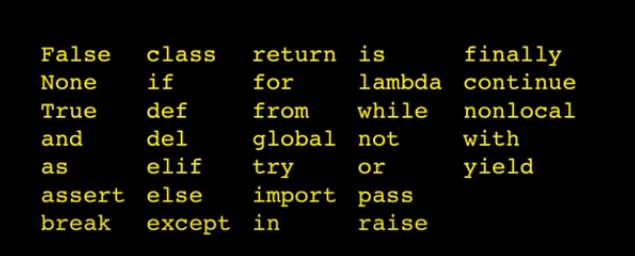
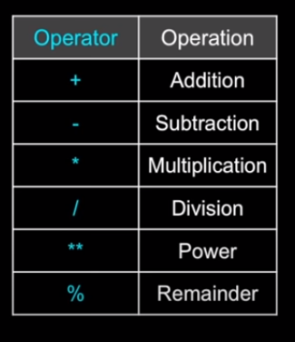

# Python

# Session 1

- Installation [Python](https://www.python.org/downloads/)
  - in the installation we install Python interpreter which interpret from python to a language that the machine know, the standard library , and some tools such as the pip package manager.
- Information about python
  - first released in 1991
  - general-purpose language that is used in a wide variety of fields, including web development, data analysis, artificial intelligence, scientific computing, and many others.
  - Python is so popular is its simplicity and ease of use
  - popular is its vast and active community.
  - It is also cross-platform, meaning that code written on one platform can be easily run on another.
  - the creator of Python, was a big fan of the British comedy group Monty Monty Python's Flying Circus, a popular British sketch comedy show that aired in the 1970s.
  - it provides automatic memory management through a process called garbage collection.
  - python is interpreted language [Snake]
  - developed by [Guido van Rossum](https://en.wikipedia.org/wiki/Guido_van_Rossum)
  - Reserved Words
    - 
  - can be written Interactive or script

## Variables

Variables are used in Python to store and manipulate data. They are essentially named containers that hold a value. In this tutorial, we will learn how to declare and assign values to variables in Python.

### Declaring Variables

In Python, we do not need to declare variables before using them. We can simply assign a value to a variable, and Python will create the variable for us. Here is an example of how to declare a variable:

```python
x = 5
```

In this example, we are declaring a variable named x and assigning it the value of 5. The equal sign = is used to assign a value to a variable.

We can also declare multiple variables at once by separating them with a comma. Here is an example

```python
x, y, z = 1, 2, 3
```

### Data Types

In Python, variables can hold values of different data types. Some of the commonly used data types are:

Integer (int): a whole number, such as 5 or 100.
Float (float): a decimal number, such as 3.14 or 2.0.
String (str): a sequence of characters, such as "hello" or "world".
Boolean (bool): a value that is either True or False.
List (list): a collection of values, such as [1, 2, 3] or ["apple", "banana", "orange"].
Tuple (tuple): a collection of values, similar to a list, but cannot be modified, such as (1, 2, 3) or ("apple", "banana", "orange").
Dictionary (dict): a collection of key-value pairs, such as {"name": "John", "age": 30}.

In Python, we can check the data type of a variable using the type() function. Here is an example:

```python
x = 5
print(type(x))
```

In this example, we are declaring a variable x and assigning it the value of 5. We are then using the type() function to check the data type of x. The output will be <class 'int'>, which means x is an integer.

### variables name rules snake_case

hamada_age
bad code

```python
  djafkljdkflj = 35.0
  ajkfjdalfjks = 12.5
  kjdaskfjkhfa = djafkljdkflj * ajkfjdalfjks
  print(kjdaskfjkhfa)
```

- code can be read

```python
 a = 35.0
 b = 12.5
 c = a * b
 print(c)
```

- much better code

```python
 hours = 35.0
 rate = 12.5
 pay = hours * rate
 print(pay)
```

### Expressions

- Expressions evaluated from left to right

  ```python
  x = 0.6
  x = x * 25 * (3-x) * 7 / x
  print(x)
  ```

  - Operators on Python
    
  - precedence rule :
    **Parenthesis > Power > Multiplication > Addition > Left to Right**

    ```python
    x = 1 + 2 ** 3 / 4 * 5
    x =  1 + 8 / 4 * 5
    x =  1 + 2 * 5
    x =  1 + 10
    x = 11
    ```

  - pluse (+) can be work as addition or concatenation
  - functions [type , float , int , str , print , input]
  - Comments [ # ]
  - Comparison Operators [< , > , == , >= , <= , !=]

## if Statement

```python
if condition1:
  # code to be executed if condition1 is true
elif condition2:
  # code to be executed if condition2 is true
else:
  # code to be executed if neither condition1 nor condition2 is true
```

### Logical Operators

**and**: Returns **True** if both operands are **True**. Otherwise, returns **False**.
**or**: Returns **True** if at least one of the operands is **True**. Otherwise, returns False.
**not**: Returns the opposite of the operand. If the operand is **True**, returns **False**. If the operand is **False**, returns **True**.

```python
x = 5
y = 10

if x > 0 and y < 15:
    print("Both conditions are True")

if x > 10 or y < 15:
    print("At least one condition is True")

if not x == y:
    print("x is not equal to y")

```

### Short-Circuit Evaluation

logical operators use short-circuit evaluation. This means that if the first operand of an and expression evaluates to False, the second operand is not evaluated, because the entire expression will always be False. Similarly, if the first operand of an or expression evaluates to True, the second operand is not evaluated, because the entire expression will always be True.

```python
def divide(x, y):
    if y != 0 and x / y > 2:
        return "x is more than twice y"
    else:
        return "y is either zero or x is less than or equal to twice y"

print(divide(10, 3))
print(divide(10, 5))
print(divide(10, 0))
```

## python code life time

Python is an interpreted language, which means that the code is executed by an interpreter at runtime, rather than being compiled into machine code ahead of time. When you run a Python program, the interpreter reads your code line by line, interpreting each statement and executing it immediately.

Python is an interpreted language, which means that the code is executed by an interpreter at runtime, rather than being compiled into machine code ahead of time. When you run a Python program, the interpreter reads your code line by line, interpreting each statement and executing it immediately.

Here's a simplified overview of the process of interpreting Python code:

- Tokenization: The interpreter reads the source code and breaks it down into a sequence of tokens, which are the basic units of the language, such as keywords, identifiers, operators, and literals.
- Parsing: The interpreter uses the tokens to build an abstract syntax tree (AST), which represents the structure of the program according to the rules of the Python grammar. The AST is a hierarchical tree-like structure that describes the relationships between the statements, expressions, and other language constructs in the program.
- Compilation: The interpreter generates bytecode from the AST, which is a lower-level representation of the program that can be executed by the Python virtual machine (PVM). The bytecode is a sequence of instructions that perform the operations specified by the code, such as assigning values to variables, calling functions, and so on.
- Execution: The interpreter runs the bytecode on the PVM, which is a runtime environment that provides the necessary infrastructure to execute the code. The PVM executes the bytecode instruction by instruction, updating the program state as it goes, such as the values of variables and the call stack.

```python
# Example code
x = 10
y = 5
if x > y:
    print("x is greater than y")
else:
    print("y is greater than x")

```

When this code is executed, the interpreter does the following:

1. Tokenizes the code into a sequence of tokens, such as x, =, 10, if, x, >, y, :, print, "x is greater than y", else, :, print, "y is greater than x", and so on.
2. Parses the tokens into an AST, which represents the structure of the code, such as a Module node with a Body node containing a FunctionDef node for the main function, a Assign node for the x = 10 statement, a Assign node for the y = 5 statement, a If node for the if statement, and so on.
3. Compiles the AST into bytecode, which represents the lower-level instructions to execute the code, such as LOAD_CONST for the 10 literal, STORE_NAME for the x variable, LOAD_NAME for the x and y variables, COMPARE_OP for the > operator, POP_JUMP_IF_FALSE for the else branch, LOAD_CONST for the "x is greater than y" string, PRINT_ITEM and PRINT_NEWLINE for the print() function, and so on.
4. Executes the bytecode on the PVM, which updates the program state and produces the output, such as x being assigned to 10, y being assigned to 5, the comparison between x and y being performed, the "x is greater than y" string being printed, and so on.

### obtain the byte code

```python
import marshal

# Open the Python file and read its contents
with open('example.py', 'r') as f:
    source_code = f.read()

# Compile the source code into a code object
code = compile(source_code, 'example.py', 'exec')

# Convert the code object to a binary format
code_bytes = marshal.dumps(code)

# Print the bytecode in hexadecimal format
print(code_bytes.hex())

```

In this example, example.py is the name of the Python file you want to compile. The compile() function takes three arguments: the source code as a string, the filename (which can be any string), and the mode, which can be 'exec', 'eval', or 'single'. The 'exec' mode is used for compiling a module or a program, and is the most common mode.

The compile() function returns a code object that represents the compiled bytecode. To print the bytecode in a readable format, we can use the hex() method to convert the bytecode to hexadecimal format.

[**AST visualization**](https://python-ast-explorer.com/)

## Tasks

1. Create a simple calculator that takes user input and performs basic arithmetic operations such as addition, subtraction, multiplication, and division using the arithmetic operators.
2. Write a program that prompts the user to enter a temperature in Celsius and converts it to Fahrenheit using the appropriate formula.
3. Write a program that prompts the user to enter a number and checks if it is a prime number using a loop and the modulo operator.
4. Write a program that input a number and output the equevelent day of the week to it
5. Write a progamme to get a grade and print the equeelent [excellent , very good , good , accpted , fail ]

# Session 2

## Python Loops

### For Loops

A for loop is used to iterate over a sequence (that is either a list, a tuple, a dictionary, a set, or a string).

```python
for variable in sequence:
    # code to be executed for each item in sequence
```

#### The range() Function

The range() function can be used to generate a sequence of numbers that can be used in a for loop. Here's the basic syntax for the range() function:

```python
for x in range(5):
    print(x)
```

### While Loops

A while loop is used to repeatedly execute a block of code as long as a specified condition is true. Here's the basic syntax for a while loop:

```python
while condition:
    # code to be executed while the condition is true
```

### break statement

```python
i = 0
while i < 5:
    print(i)
    i += 1
    if i == 3:
        break

```

### continue statement

```python
i = 0
while i < 5:
    print(i)
    i += 1
    if i == 3:
        continue
```

## Strings

A string is a sequence of characters in Python. You can create a string by enclosing characters inside single or double quotes. For example:

```python
my_string = "Hello, World!"
# you can use single or double quotes
```

### multiline string

The ''' and """ characters are used to create multi-line string literals in Python. A multi-line string literal can span across multiple lines of code and can contain newline characters, tabs, and other whitespace characters.

For example, you can define a multi-line string literal like this:

```python
my_string = '''
This is a multi-line string.
It can contain multiple lines of text.
Each line can include newline characters,
tabs, and other whitespace.
'''
```

_You can also use double quotes (""") instead of single quotes (''') to create a multi-line string literal._

### Formatted String

You can use formatted string literals (f-strings) to insert values into strings in Python. Formatted string literals are a recent addition to Python, introduced in Python 3.6, and they provide a more concise and readable way to format strings compared to other methods such as the % operator or the str.format() method.

```python
name = 'Alice'
age = 30
profession = 'software engineer'

# Create a formatted string using f-strings
greeting = f"Hello, my name is {name}. I'm {age} years old, and I work as a {profession}."

# Print the formatted string
print(greeting)

```

### String Operations

1.  Concatenation
    You can concatenate strings using the + operator. For example:

    ```python
    first_name = 'John'
    last_name = 'Doe'
    full_name = first_name + ' ' + last_name
    ```

2.  Repetition
    You can repeat a string multiple times using the \_ operator. For example:

    ```python
    my_string = 'hello '
    my_string = my_string _ 3

    ```

3.  Slicing
    You can slice a string to obtain a specific portion of it. The syntax for slicing is string[start:stop:step], where start is the index of the first character you want to include, stop is the index of the first character you want to exclude, and step is the size of the jump between characters. For example:

    ```python
    my_string = 'hello world'
    substring = my_string[0:5] # substring is set to 'hello'
    ```

4.  Length
    You can find the length of a string using the len() function. For example:

```python
my_string = 'hello world'
length = len(my_string) # length is set to 11
```

### string functions

```python
s = "The quick brown fox jumps over the lazy dog"

# Convert the string to uppercase
s_upper = s.upper()
print(s_upper)  # Output: "THE QUICK BROWN FOX JUMPS OVER THE LAZY DOG"

# Convert the string to lowercase
s_lower = s.lower()
print(s_lower)  # Output: "the quick brown fox jumps over the lazy dog"

# Replace a substring with another substring
s_replaced = s.replace("fox", "cat")
print(s_replaced)  # Output: "The quick brown cat jumps over the lazy dog"

# Count the occurrences of a substring
s_count = s.count("o")
print(s_count)  # Output: 4

# Check if the string starts with a specific substring
s_starts_with = s.startswith("The")
print(s_starts_with)  # Output: True

# Check if the string ends with a specific substring
s_ends_with = s.endswith("dog")
print(s_ends_with)  # Output: True

# Split the string into a list of substrings
s_split = s.split()
print(s_split)  # Output: ["The", "quick", "brown", "fox", "jumps", "over", "the", "lazy", "dog"]

# Join a list of substrings into a single string
s_join = "-".join(s_split)
print(s_join)  # Output: "The-quick-brown-fox-jumps-over-the-lazy-dog"

```

## Tasks

1. Write a program that prompts the user to enter a string and counts the number of characters in the string using the len() function.
2. Write a program that prompts the user to enter a number and determines whether it is even or odd using the modulo operator (%).
3. Write a program that uses a for loop to iterate over a list of numbers and prints the sum of the numbers.
4. Write a program that uses a while loop to repeatedly prompt the user to enter a password until they enter the correct password.
5. Write a program that reads a file and counts the number of lines, words, and characters in the file.
6. Write a program that uses a function to calculate the area and perimeter of a rectangle based on user input for the length and width.
7. Write a program that prompts the user to enter a sentence and then reverses the order of the words in the sentence.
